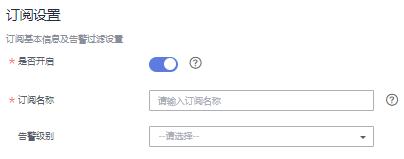
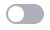
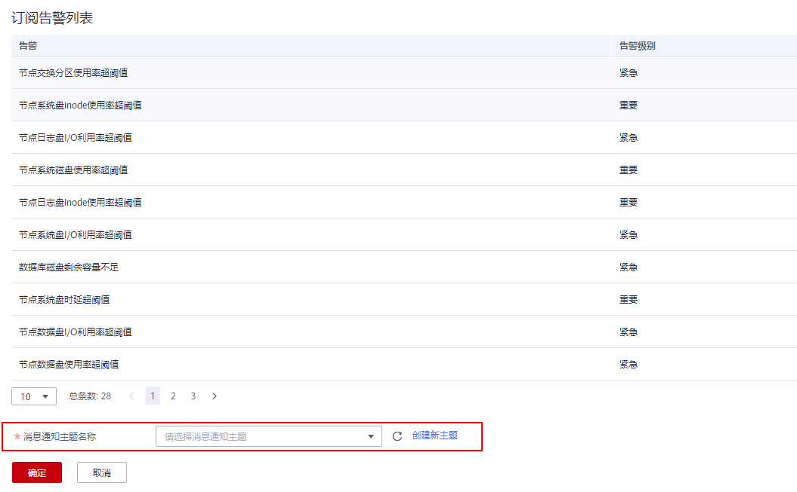
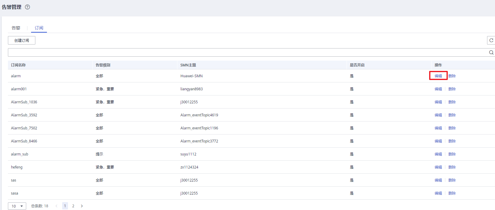
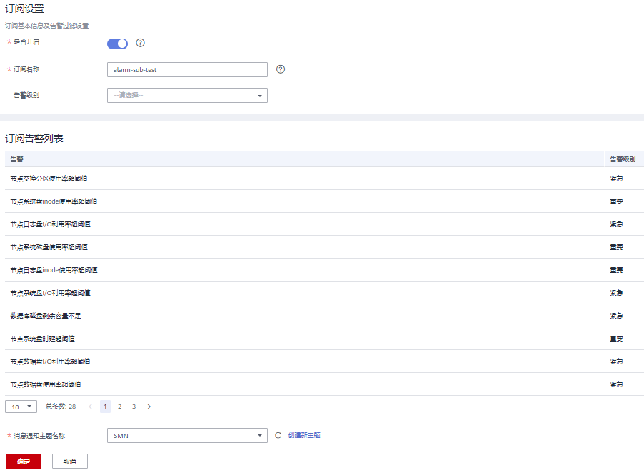
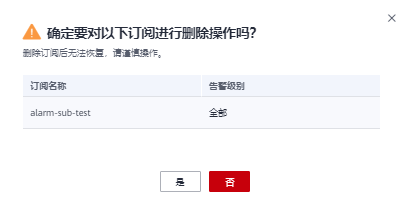

# 订阅告警通知

用户可通过订阅GaussDB\(DWS\) 的告警通知，在特定告警级别告警时收到短信、电子邮件或应用等方式的通知消息。

## 创建订阅

1.  登录GaussDB\(DWS\) 管理控制台。
2.  在左侧导航树，单击“告警管理”，切换至“订阅”页签。
3.  在页面左上角单击“创建订阅”按钮。
4.  在“订阅设置”区域，设置订阅基本信息及告警过滤。

    

    **表 1**  订阅参数

    
    <table><thead align="left"><tr id="row4704172711114"><th class="cellrowborder" valign="top" width="15.7%" id="mcps1.2.3.1.1">
参数名

    </th>
    <th class="cellrowborder" valign="top" width="84.3%" id="mcps1.2.3.1.2">
参数解释

    </th>
    </tr>
    </thead>
    <tbody><tr id="row127045270117"><td class="cellrowborder" valign="top" width="15.7%" headers="mcps1.2.3.1.1 ">
是否开启

    </td>
    <td class="cellrowborder" valign="top" width="84.3%" headers="mcps1.2.3.1.2 ">
设置是否开启告警订阅。

    
表示开启告警订阅。表示关闭告警订阅。关闭后停止发送已订阅告警的通知消息，但不会删除该订阅。

    </td>
    </tr>
    <tr id="row137055276114"><td class="cellrowborder" valign="top" width="15.7%" headers="mcps1.2.3.1.1 ">
订阅名称

    </td>
    <td class="cellrowborder" valign="top" width="84.3%" headers="mcps1.2.3.1.2 ">
设置订阅告警的名称。

    <ul id="ul386613493427"><li>名称只能包含大写字母、小写字母、数字、-和_，且必须由大写字母、小写字母或数字开头。</li><li>名称长度为1～256字符。</li></ul>
    </td>
    </tr>
    <tr id="row0705027131110"><td class="cellrowborder" valign="top" width="15.7%" headers="mcps1.2.3.1.1 ">
告警级别

    </td>
    <td class="cellrowborder" valign="top" width="84.3%" headers="mcps1.2.3.1.2 ">
选择订阅告警的级别：紧急、重要、次要和提示。

    </td>
    </tr>
    </tbody>
    </table>

5.  “订阅告警列表”区域显示系统根据订阅设置筛选出的告警。在“消息通知主题名称”下拉框中，选择一个消息通知主题。

    如需创建新主题，请单击“创建新主题”按钮，系统将跳转到消息通知服务控制台页面，具体请参见《消息通知服务用户指南》中的[创建主题](https://support.huaweicloud.com/usermanual-smn/zh-cn_topic_0043961401.html)章节。

    

    > **说明：** 
    >所选择的消息通知主题，必须已授予GaussDB\(DWS\) 服务向该主题发布消息的权限。如果所选主题尚未给GaussDB\(DWS\) 授权，请前往消息通知服务的主题管理页面设置主题策略授权。详细操作请参见《消息通知服务用户指南》中的[设置主题策略](https://support.huaweicloud.com/usermanual-smn/zh-cn_topic_0043394891.html)章节。。设置主题策略时，“可发布消息的服务”需勾选“DWS“。

6.  确认无误后，单击“确定”，完成创建订阅。

## 修改订阅

1.  登录GaussDB\(DWS\) 管理控制台。
2.  在左侧导航树，单击“告警管理”，切换至“订阅”页签。
3.  在指定订阅名称所在行操作列，单击“编辑”按钮，进入“编辑订阅”页面。

    

4.  在编辑订阅页面，选择要更改的参数项进行修改。具体修改方法参见创建订阅中的[4](#li18772435125416)～[5](#li125355552147)。

    

5.  确认无误后，单击“确定”。

## 删除订阅

1.  登录GaussDB\(DWS\) 管理控制台。
2.  在左侧导航树，单击“告警管理”，切换至订阅页签。
3.  在指定订阅名称所在行操作列，单击“删除”按钮，弹出确认删除对话框。

    

4.  单击“是”，删除该订阅。

