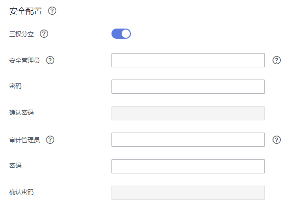

# 设置三权分立

## 操作场景

默认情况下，创建DWS集群时指定的管理员用户属于数据库的系统管理员，能够创建其他用户和查看数据库的审计日志，即权限不分立，三权分立模式为关闭。

为了保护集群数据的安全，DWS支持对集群设置三权分立，使用不同类型的用户分别控制不同权限的模式。

默认的权限模型和开启三权分立后的权限模型，请参见《[数据仓库服务数据库开发指南](https://support.huaweicloud.com/devg-dws/preface.html)》的[三权分立](https://support.huaweicloud.com/devg-dws/rights_separation.html)章节。

## 对系统的影响

修改安全配置参数并保存生效可能需要重启集群，将导致集群暂时不可用。

## 前提条件

修改集群安全配置必须同时满足以下两个条件：

-   集群状态为“可用“或“低性能“。
-   任务信息不能处于“创建快照中“、“调整大小“、“配置中“或“重启中“。

## 操作步骤

1.  通过访问以下地址登录DWS管理控制台：[https://console.huaweicloud.com/dws](https://console.huaweicloud.com/dws)。
2.  在左侧导航树中，单击“集群管理“。
3.  在集群列表中，单击指定集群的名称，然后单击“安全设置“。

    默认显示“配置状态“为“已同步“，表示页面显示的是数据库当前最新结果。

4.  在“安全设置“页面，设置三权分立。

    表示开启三权分立模式。开启“三权分立“后，分别设置“安全管理员“和“审计管理员“的用户名和密码，系统将会创建这两个用户。使用这两个用户可以连接数据库并执行数据库的相关操作。

    表示关闭三权分立模式。默认为关闭状态。

    **图 1**  安全配置  
    

    **表 1**  安全配置参数说明

    
    <table><thead align="left"><tr id="row1625953112519"><th class="cellrowborder" valign="top" width="20%" id="mcps1.2.4.1.1">
参数名

    </th>
    <th class="cellrowborder" valign="top" width="59%" id="mcps1.2.4.1.2">
参数解释

    </th>
    <th class="cellrowborder" valign="top" width="21%" id="mcps1.2.4.1.3">
样例值

    </th>
    </tr>
    </thead>
    <tbody><tr id="row626115316259"><td class="cellrowborder" valign="top" width="20%" headers="mcps1.2.4.1.1 ">
安全管理员

    </td>
    <td class="cellrowborder" valign="top" width="59%" headers="mcps1.2.4.1.2 ">
用户命名要求如下：

    <ul id="ul925811254311"><li>只能由小写字母、数字或下划线组成。</li><li>必须以小写字母或下划线开头。</li><li>长度为6～64个字符。</li><li>用户名不能为DWS数据库的关键字。DWS数据库的关键字，具体请参见《数据仓库服务数据库开发指南》中<a href="https://support.huaweicloud.com/devg-dws/keyword.html" target="_blank" rel="noopener noreferrer">关键字</a>章节。</li></ul>
    </td>
    <td class="cellrowborder" valign="top" width="21%" headers="mcps1.2.4.1.3 ">
security_admin

    </td>
    </tr>
    <tr id="row326125322513"><td class="cellrowborder" valign="top" width="20%" headers="mcps1.2.4.1.1 ">
密码

    </td>
    <td class="cellrowborder" valign="top" width="59%" headers="mcps1.2.4.1.2 ">
密码复杂度要求如下：<ul id="dws_01_0019_ul13418111318144"><li>密码长度为8～32个字符。</li><li>不能与用户名或倒序的用户名相同。</li><li>密码至少包含大写字母、小写字母、数字和特殊字符四类中的三类，其中可输入的特殊字符为：~!@#%^&amp;*()-_=+|[{}];:,&lt;.&gt;/?</li><li>弱口令检查。</li></ul>
    

    </td>
    <td class="cellrowborder" valign="top" width="21%" headers="mcps1.2.4.1.3 ">
Dws_2018!

    </td>
    </tr>
    <tr id="row82645310256"><td class="cellrowborder" valign="top" width="20%" headers="mcps1.2.4.1.1 ">
确认密码

    </td>
    <td class="cellrowborder" valign="top" width="59%" headers="mcps1.2.4.1.2 ">
再次输入安全管理员密码。

    </td>
    <td class="cellrowborder" valign="top" width="21%" headers="mcps1.2.4.1.3 ">
-

    </td>
    </tr>
    <tr id="row3931218192713"><td class="cellrowborder" valign="top" width="20%" headers="mcps1.2.4.1.1 ">
审计管理员

    </td>
    <td class="cellrowborder" valign="top" width="59%" headers="mcps1.2.4.1.2 ">
用户命名要求如下：

    <ul id="ul615614912298"><li>只能由小写字母、数字或下划线组成。</li><li>必须以小写字母或下划线开头。</li><li>长度为6～64个字符。</li><li>用户名不能为DWS数据库的关键字。DWS数据库的关键字，具体请参见《数据仓库服务数据库开发指南》中<a href="https://support.huaweicloud.com/devg-dws/keyword.html" target="_blank" rel="noopener noreferrer">关键字</a>章节。</li></ul>
    </td>
    <td class="cellrowborder" valign="top" width="21%" headers="mcps1.2.4.1.3 ">
audit_admin

    </td>
    </tr>
    <tr id="row16584121102717"><td class="cellrowborder" valign="top" width="20%" headers="mcps1.2.4.1.1 ">
密码

    </td>
    <td class="cellrowborder" valign="top" width="59%" headers="mcps1.2.4.1.2 ">
密码复杂度要求如下：<ul id="dws_01_0074_dws_01_0019_ul13418111318144"><li>密码长度为8～32个字符。</li><li>不能与用户名或倒序的用户名相同。</li><li>密码至少包含大写字母、小写字母、数字和特殊字符四类中的三类，其中可输入的特殊字符为：~!@#%^&amp;*()-_=+|[{}];:,&lt;.&gt;/?</li><li>弱口令检查。</li></ul>
    

    </td>
    <td class="cellrowborder" valign="top" width="21%" headers="mcps1.2.4.1.3 ">
Dws_2018!

    </td>
    </tr>
    <tr id="row16526153272717"><td class="cellrowborder" valign="top" width="20%" headers="mcps1.2.4.1.1 ">
确认密码

    </td>
    <td class="cellrowborder" valign="top" width="59%" headers="mcps1.2.4.1.2 ">
再次输入审计管理员密码。

    </td>
    <td class="cellrowborder" valign="top" width="21%" headers="mcps1.2.4.1.3 ">
-

    </td>
    </tr>
    </tbody>
    </table>

5.  单击“应用“。
6.  在弹出的“保存配置“窗口中，选择是否勾选“立即重启集群“，然后单击“是“。

    -   如果勾选“立即重启集群“，系统将保存“安全设置“页面的配置并立即重启集群，集群重启成功后安全设置将立即生效。
    -   如果不勾选“立即重启集群“，系统将只保存“安全设置“页面的配置。稍后，用户需要手动重启集群才能使安全设置生效。

    安全设置完成后，在“安全设置“页面，“配置状态“有如下3种状态：

    -   “应用中“：表示系统正在保存配置。
    -   “已同步“：表示配置已保存生效。
    -   “需重启生效“：表示配置已保存但还未生效。如需生效，需重启集群。

