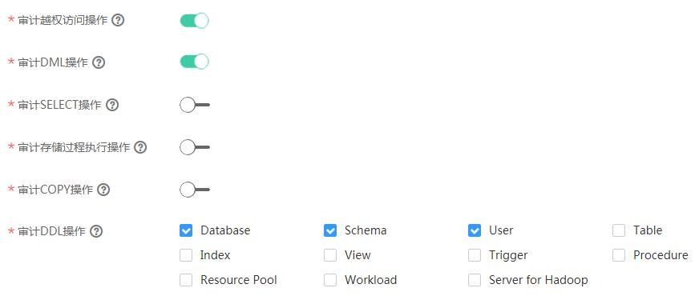

# 设置数据库审计日志

## 操作场景

DWS支持对特定数据库操作记录审计日志，包括：日志保留策略、用户越权访问、存储过程以及对数据库对象的DML、SELECT、COPY和DDL操作。

审计日志配置后，当DWS集群状态异常，或根据业务需要，用户可以查询审计信息确定故障原因或定位历史操作记录。

关于如何查看审计日志信息，请参见《数据仓库服务数据库开发指南》中[查看审计信息](https://support.huaweicloud.com/devg-dws/query_audit_Info_0001.html)章节。

## 前提条件

数据库审计日志在集群的“安全配置“页面中进行设置，仅“可用“和“低性能“状态的集群才支持修改安全配置，同时集群的任务信息不能处于“创建快照中“、“调整大小“、“配置中“和“重启中“。

## 操作步骤

1.  登录[DWS管理控制台](https://console.huaweicloud.com/dws)。
2.  单击“集群管理“。
3.  在集群列表中，单击指定集群的名称，然后单击“安全设置“。

    默认显示“配置状态“为“已同步“，表示页面显示的是数据库当前最新结果。

4.  在“审计配置“区域中，设置审计日志保留策略。

    **图 1**  审计日志保留策略  
    

    详细信息如[表1](#table6661375615299)所示。

    **表 1**  审计日志保留策略

    
    <table><thead align="left"><tr id="row1350660815299"><th class="cellrowborder" valign="top" width="30%" id="mcps1.2.3.1.1">
参数名

    </th>
    <th class="cellrowborder" valign="top" width="70%" id="mcps1.2.3.1.2">
说明

    </th>
    </tr>
    </thead>
    <tbody><tr id="row136071215299"><td class="cellrowborder" valign="top" width="30%" headers="mcps1.2.3.1.1 ">
审计日志保留策略

    </td>
    <td class="cellrowborder" valign="top" width="70%" headers="mcps1.2.3.1.2 ">
设置审计日志保留策略，支持如下两种策略：

    <ul id="ul1940693315299"><li>“空间优先”：表示当单个节点的审计日志超过1G后，将自动淘汰审计日志。</li><li>“时间优先”：表示在“审计日志最小保存时间（天）”内会保留审计日志，超过时间后，根据存储容量限制（单个节点1G），对审计日志进行自动淘汰。</li></ul>
    
默认策略是“空间优先”。

    
 说明： 

版本号为1.0.0和1.1.0的集群不支持设置审计日志保留策略。

    

    </td>
    </tr>
    <tr id="row5752884715299"><td class="cellrowborder" valign="top" width="30%" headers="mcps1.2.3.1.1 ">
审计日志最小保存时间（天）

    </td>
    <td class="cellrowborder" valign="top" width="70%" headers="mcps1.2.3.1.2 ">
当“审计日志保留策略”设置为“时间优先”策略时，该参数有效。

    
可选天数为0~730天，默认值为90天。

    </td>
    </tr>
    </tbody>
    </table>

5.  根据需要设置以下操作的审计开关。

    表示开启状态。表示关闭状态。

    **图 2**  审计项  
    

    各审计项的详细信息如[表2](#table48954270153356)所示。

    **表 2**  审计项

    
    <table><thead align="left"><tr id="row11786533153356"><th class="cellrowborder" valign="top" width="30%" id="mcps1.2.3.1.1">
参数名

    </th>
    <th class="cellrowborder" valign="top" width="70%" id="mcps1.2.3.1.2">
说明

    </th>
    </tr>
    </thead>
    <tbody><tr id="row40202069153356"><td class="cellrowborder" valign="top" width="30%" headers="mcps1.2.3.1.1 ">
审计用户越权访问操作

    </td>
    <td class="cellrowborder" valign="top" width="70%" headers="mcps1.2.3.1.2 ">
表示是否记录用户的越权访问操作，默认关闭。

    </td>
    </tr>
    <tr id="row48931238153356"><td class="cellrowborder" valign="top" width="30%" headers="mcps1.2.3.1.1 ">
审计DML操作

    </td>
    <td class="cellrowborder" valign="top" width="70%" headers="mcps1.2.3.1.2 ">
表示是否对数据表的<strong id="b35660574153356">INSERT</strong>、<strong id="b52509711153356">UPDATE</strong>和<strong id="b2825353153356">DELETE</strong>操作进行记录，默认关闭。

    </td>
    </tr>
    <tr id="row15098169153356"><td class="cellrowborder" valign="top" width="30%" headers="mcps1.2.3.1.1 ">
审计SELECT操作

    </td>
    <td class="cellrowborder" valign="top" width="70%" headers="mcps1.2.3.1.2 ">
表示是否对<strong id="b57682765153356">SELECT</strong>操作进行记录，默认关闭。

    </td>
    </tr>
    <tr id="row41792394153356"><td class="cellrowborder" valign="top" width="30%" headers="mcps1.2.3.1.1 ">
审计存储过程执行

    </td>
    <td class="cellrowborder" valign="top" width="70%" headers="mcps1.2.3.1.2 ">
表示是否在执行存储过程和自定义函数的时候记录操作信息，默认关闭。

    </td>
    </tr>
    <tr id="row43739917153356"><td class="cellrowborder" valign="top" width="30%" headers="mcps1.2.3.1.1 ">
审计COPY操作

    </td>
    <td class="cellrowborder" valign="top" width="70%" headers="mcps1.2.3.1.2 ">
表示是否对<strong id="b46630216153356">COPY</strong>操作进行记录，默认关闭。

    </td>
    </tr>
    <tr id="row18951113153356"><td class="cellrowborder" valign="top" width="30%" headers="mcps1.2.3.1.1 ">
审计DDL操作

    </td>
    <td class="cellrowborder" valign="top" width="70%" headers="mcps1.2.3.1.2 ">
表示是否对指定数据库对象的<strong id="b3989363153356">CREATE</strong>、<strong id="b35904272153356">DROP</strong>和<strong id="b54702997153356">ALTER</strong>操作进行记录。除“Database”、“Schema”和“User”默认启用记录，其他默认关闭。

    </td>
    </tr>
    </tbody>
    </table>

    DWS除了支持[表2](#table48954270153356)的审计功能，默认还开启了如[表3](#table24262392153654)所示的关键审计项。

    **表 3**  关键审计项

    
    <table><thead align="left"><tr id="row1697543153654"><th class="cellrowborder" valign="top" width="30%" id="mcps1.2.3.1.1">
参数名

    </th>
    <th class="cellrowborder" valign="top" width="70%" id="mcps1.2.3.1.2">
说明

    </th>
    </tr>
    </thead>
    <tbody><tr id="row66708561153654"><td class="cellrowborder" rowspan="5" valign="top" width="30%" headers="mcps1.2.3.1.1 ">
关键审计项

    </td>
    <td class="cellrowborder" valign="top" width="70%" headers="mcps1.2.3.1.2 ">
记录用户登录成功、登录失败和注销的信息。

    </td>
    </tr>
    <tr id="row65272081153654"><td class="cellrowborder" valign="top" headers="mcps1.2.3.1.1 ">
记录数据库启动、停止、恢复和切换审计信息。

    </td>
    </tr>
    <tr id="row3162576153654"><td class="cellrowborder" valign="top" headers="mcps1.2.3.1.1 ">
记录用户锁定和解锁功能信息。

    </td>
    </tr>
    <tr id="row23817212153654"><td class="cellrowborder" valign="top" headers="mcps1.2.3.1.1 ">
记录用户权限授予和权限回收信息。

    </td>
    </tr>
    <tr id="row48661263153654"><td class="cellrowborder" valign="top" headers="mcps1.2.3.1.1 ">
记录SET操作的审计功能。

    </td>
    </tr>
    </tbody>
    </table>

6.  单击“应用“。

    单击，“配置状态“显示为“应用中“，表示系统正在保存配置。

    等待一段时间后再次刷新“配置状态“，当显示为“已同步“，表示已保存配置并生效。

