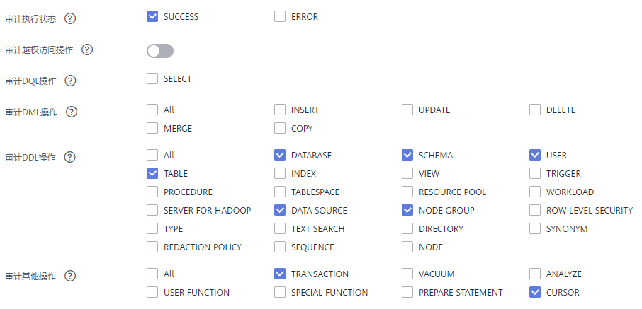

# 设置数据库审计日志

## 前提条件

数据库审计日志在集群的“安全配置“页面中进行设置，仅“可用“和“非均衡“状态的集群才支持修改安全配置，同时集群的任务信息不能处于“创建快照中“、“节点扩容“、“配置中“和“重启中“。

## 操作步骤

1.  登录GaussDB\(DWS\) 管理控制台。
2.  单击“集群管理“。
3.  在集群列表中，单击指定集群的名称，然后在左侧导航栏单击“安全设置“。

    默认显示“配置状态“为“已同步“，表示页面显示的是数据库当前最新结果。

4.  在“审计配置“区域中，设置审计日志保留策略。

    

    “空间优先“：表示当单个节点的审计日志超过1G后，将自动淘汰审计日志。

    > **注意：** 
    >-   版本号为1.0.0和1.1.0的集群不支持设置审计日志保留策略。
    >-   如果数据库规划存储空间有限，建议设置为“空间优先”策略，避免因审计日志占用磁盘空间高导致节点故障或性能低。

5.  根据需要设置以下操作的审计开关。

    > **说明：** 
    >8.1.1.100及以上的版本支持更细粒度的审计项。

    **图 1**  审计项  
    

    各审计项的详细信息如[表1](#zh-cn_topic_0000001098656870_table48954270153356)所示。

    **表 1**  审计项

    
    <table><thead align="left"><tr id="zh-cn_topic_0000001098656870_row11786533153356"><th class="cellrowborder" valign="top" width="30%" id="mcps1.2.3.1.1">
参数名

    </th>
    <th class="cellrowborder" valign="top" width="70%" id="mcps1.2.3.1.2">
说明

    </th>
    </tr>
    </thead>
    <tbody><tr id="zh-cn_topic_0000001098656870_row40202069153356"><td class="cellrowborder" valign="top" width="30%" headers="mcps1.2.3.1.1 ">
审计用户越权访问操作

    </td>
    <td class="cellrowborder" valign="top" width="70%" headers="mcps1.2.3.1.2 ">
表示是否记录用户的越权访问操作，默认关闭。

    </td>
    </tr>
    <tr id="zh-cn_topic_0000001098656870_row6485163795419"><td class="cellrowborder" valign="top" width="30%" headers="mcps1.2.3.1.1 ">
审计DQL操作

    </td>
    <td class="cellrowborder" valign="top" width="70%" headers="mcps1.2.3.1.2 ">
可选SELECT操作进行审计。

    
 说明： 

支持8.1.1.100及以上版本。

    

    </td>
    </tr>
    <tr id="zh-cn_topic_0000001098656870_row48931238153356"><td class="cellrowborder" valign="top" width="30%" headers="mcps1.2.3.1.1 ">
审计DML操作

    </td>
    <td class="cellrowborder" valign="top" width="70%" headers="mcps1.2.3.1.2 ">
表示是否对数据表的<strong id="zh-cn_topic_0000001098656870_b35660574153356">INSERT</strong>、<strong id="zh-cn_topic_0000001098656870_b52509711153356">UPDATE</strong>和<strong id="zh-cn_topic_0000001098656870_b2825353153356">DELETE</strong>操作进行记录，默认关闭。

    
 说明： 

集群支持在8.1.1.100及以上版本做各审计项的细粒度拆分，并增加<strong id="zh-cn_topic_0000001098656870_b551503717310">COPY</strong>，<strong id="zh-cn_topic_0000001098656870_b135151372311">MERGE</strong>选项。

    

    </td>
    </tr>
    <tr id="zh-cn_topic_0000001098656870_row18951113153356"><td class="cellrowborder" valign="top" width="30%" headers="mcps1.2.3.1.1 ">
审计DDL操作

    </td>
    <td class="cellrowborder" valign="top" width="70%" headers="mcps1.2.3.1.2 ">
表示是否对指定数据库对象的<strong id="zh-cn_topic_0000001098656870_b3989363153356">CREATE</strong>、<strong id="zh-cn_topic_0000001098656870_b35904272153356">DROP</strong>和<strong id="zh-cn_topic_0000001098656870_b54702997153356">ALTER</strong>操作进行记录。除“DATABASE”、“SCHEMA”和“USER”默认启用记录，其他默认关闭。

    
 说明： 

集群支持在8.1.1.100及以上版本新增“TABLE”、“DATA SOURCE”和“NODE GROUP”操作，默认启用。

    

    

    </td>
    </tr>
    <tr id="zh-cn_topic_0000001098656870_row58261120185513"><td class="cellrowborder" valign="top" width="30%" headers="mcps1.2.3.1.1 ">
审计其他操作

    </td>
    <td class="cellrowborder" valign="top" width="70%" headers="mcps1.2.3.1.2 ">
表示对其他的操作进行记录，其中<strong id="zh-cn_topic_0000001098656870_b7423142172918">TRANSACTION</strong>，<strong id="zh-cn_topic_0000001098656870_b463910472291">CURSOR</strong>操作，默认勾选，<strong id="zh-cn_topic_0000001098656870_b519565212916">VACUUM</strong>，<strong id="zh-cn_topic_0000001098656870_b182301531309">ANALYZE</strong>，<strong id="zh-cn_topic_0000001098656870_b13209912173011">USER FUNCTION</strong>，<strong id="zh-cn_topic_0000001098656870_b10307121833019">SPECIAL FUNCTION</strong>，<strong id="zh-cn_topic_0000001098656870_b9951924183019">PREPARE STATEMENT</strong>默认关闭。

    
 说明： 
<ul id="zh-cn_topic_0000001098656870_ul689495812213"><li>支持8.1.1.100及以上版本。</li><li>建议TRANSACTION审计项保持勾选，否则事务内语句将不会审计。</li><li>建议CURSOR审计项保持勾选，否则CURSOR内SELECT语句将不会被审计。需注意Data Studio客户端会自动给SELECT语句封装CURSOR。</li></ul>
    

    </td>
    </tr>
    </tbody>
    </table>

    GaussDB\(DWS\) 除了支持[表1](#zh-cn_topic_0000001098656870_table48954270153356)的审计功能，默认还开启了如[表2](#zh-cn_topic_0000001098656870_table24262392153654)所示的关键审计项。

    **表 2**  关键审计项

    
    <table><thead align="left"><tr id="zh-cn_topic_0000001098656870_row1697543153654"><th class="cellrowborder" valign="top" width="30%" id="mcps1.2.3.1.1">
参数名

    </th>
    <th class="cellrowborder" valign="top" width="70%" id="mcps1.2.3.1.2">
说明

    </th>
    </tr>
    </thead>
    <tbody><tr id="zh-cn_topic_0000001098656870_row66708561153654"><td class="cellrowborder" rowspan="5" valign="top" width="30%" headers="mcps1.2.3.1.1 ">
关键审计项

    </td>
    <td class="cellrowborder" valign="top" width="70%" headers="mcps1.2.3.1.2 ">
记录用户登录成功、登录失败和注销的信息。

    </td>
    </tr>
    <tr id="zh-cn_topic_0000001098656870_row65272081153654"><td class="cellrowborder" valign="top" headers="mcps1.2.3.1.1 ">
记录数据库启动、停止、恢复和切换审计信息。

    </td>
    </tr>
    <tr id="zh-cn_topic_0000001098656870_row3162576153654"><td class="cellrowborder" valign="top" headers="mcps1.2.3.1.1 ">
记录用户锁定和解锁功能信息。

    </td>
    </tr>
    <tr id="zh-cn_topic_0000001098656870_row23817212153654"><td class="cellrowborder" valign="top" headers="mcps1.2.3.1.1 ">
记录用户权限授予和权限回收信息。

    </td>
    </tr>
    <tr id="zh-cn_topic_0000001098656870_row48661263153654"><td class="cellrowborder" valign="top" headers="mcps1.2.3.1.1 ">
记录SET操作的审计功能。

    </td>
    </tr>
    </tbody>
    </table>

6.  设置是否开启审计日志转储功能。

    关于审计日志转储功能的更多信息，请参见[开启审计日志转储](转储数据库审计日志.md#zh-cn_topic_0000001145696613_section8182105814130)。

7.  单击“应用“。

    单击，“配置状态“显示为“应用中“，表示系统正在保存配置。

    等待一段时间后再次刷新“配置状态“，当显示为“已同步“，表示已保存配置并生效。

