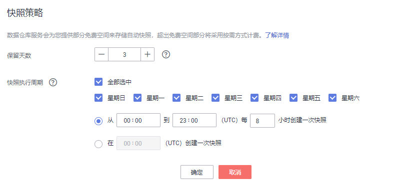

# 设置自动快照策略

用户可以对集群设置自动快照策略。自动快照策略开启后，系统会按照设定的时间和周期自动创建快照。

## 设置自动快照策略

1.  登录[DWS管理控制台](https://console.huaweicloud.com/dws)。
2.  在左侧导航栏中，单击“集群管理“。
3.  在集群列表中，单击指定集群的名称，单击“快照“页签。
4.  在“快照“页面，单击“自动快照状态“开关，开启自动快照策略，开启后将弹出“快照策略“页面
    -   表示开启自动创建快照策略。
    -   表示关闭自动创建快照策略，默认为打开状态。

5.  在“快照策略“页面上，请设置以下快照策略参数。

    **图 1**  设置自动快照策略  
    

    **表 1**  快照策略参数说明

    
    <table><thead align="left"><tr id="row555312181040"><th class="cellrowborder" valign="top" width="18.4%" id="mcps1.2.3.1.1">
参数名

    </th>
    <th class="cellrowborder" valign="top" width="81.6%" id="mcps1.2.3.1.2">
参数解释

    </th>
    </tr>
    </thead>
    <tbody><tr id="row155542181842"><td class="cellrowborder" valign="top" width="18.4%" headers="mcps1.2.3.1.1 ">
保留天数

    </td>
    <td class="cellrowborder" valign="top" width="81.6%" headers="mcps1.2.3.1.2 ">
设置自动创建的快照的保留天数，可设置范围为1~31天。

    
 说明： 

用户不能手动删除自动创建的快照，自动快照保留天数超期后，系统会自动删除。

    

    </td>
    </tr>
    <tr id="row6972171581119"><td class="cellrowborder" valign="top" width="18.4%" headers="mcps1.2.3.1.1 ">
快照执行周期

    </td>
    <td class="cellrowborder" valign="top" width="81.6%" headers="mcps1.2.3.1.2 ">
设置创建自动快照的周期。可以设置每周哪几天创建自动快照，以及创建自动快照的频率，支持每天创建一次或者每天间隔几个小时创建一次自动快照。

    </td>
    </tr>
    </tbody>
    </table>

6.  单击“确定“。
7.  （可选）单击“修改快照策略“，对已经开启的自动创建快照策略进行修改。

