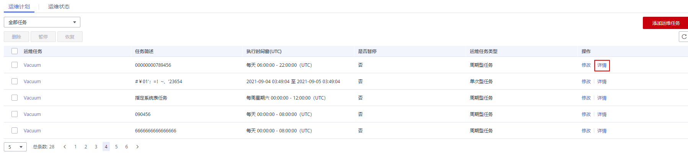

# 设置自动快照策略

用户可根据自身需求，选择快照类型对集群设置一个或多个自动快照策略。自动快照策略开启后，系统将按照设定的时间和周期以及快照类型自动创建快照。

## 设置自动快照策略

1.  登录GaussDB\(DWS\) 管理控制台。
2.  在左侧导航栏中，单击“集群管理“。
3.  在集群列表中，单击指定集群的名称，切换至“快照“页签，再单击二级页签中的策略列表。
4.  在“策略列表“页面，会展示当前集群所有的策略，单击“自动快照状态“开关，开启自动快照策略。
    -   表示开启自动创建快照策略，默认为打开状态。
    -   表示关闭自动创建快照策略，关闭会自动删除历史自动快照。

5.  开启后可以设置自动快照的保留天数。

    **表 1**  自动快照参数说明

    
    <table><thead align="left"><tr id="row0161419151913"><th class="cellrowborder" valign="top" width="18.56%" id="mcps1.2.3.1.1">
参数名

    </th>
    <th class="cellrowborder" valign="top" width="81.44%" id="mcps1.2.3.1.2">
参数解释

    </th>
    </tr>
    </thead>
    <tbody><tr id="row1416211911910"><td class="cellrowborder" valign="top" width="18.56%" headers="mcps1.2.3.1.1 ">
保留天数

    </td>
    <td class="cellrowborder" valign="top" width="81.44%" headers="mcps1.2.3.1.2 ">
设置自动创建的快照的保留天数，可设置范围为1~31天。

    
 说明： 

用户不允许手动删除自动创建的快照，自动快照保留天数超期后，系统会自动删除。

    

    </td>
    </tr>
    </tbody>
    </table>

## 设置自动快照参数

1.  用户进行新增快照策略操作时，在进行设置快照策略时间这一步，需设置为UTC时间，以及根据业务所在时区结合时差进行选择。
    -   当选择快照类型为全量快照时，快照策略可选一次性和周期性，如下图所示：
        -   设置全量周期性快照策略，可指定星期或日期，选择触发时间点。

            

        -   设置全量一次性快照策略，可指定具体日期和触发时间。

            

    -   当选择快照类型为增量快照时，快照策略只可选择周期性，如下图所示：
        -   设置增量周期性快照策略，可以指定星期或日期，并且可以选择触发时间点，或设置开始时间以及时间间隔。

            

            

            > **警告：** 
            >29号、30号、31号为月末日期，会存在漏备，请谨慎选择。

2.  单击“确定“。

    > **说明：** 
    >一个集群最多可设置三个备份策略。

3.  （可选）用户可根据自身需求在指定自动快照策略中单击“修改“按钮对使用中的策略进行修改。

    **表 2**  设置快照策略参数说明

    
    <table><thead align="left"><tr id="row1712361847"><th class="cellrowborder" valign="top" width="18.56%" id="mcps1.2.3.1.1">
参数名

    </th>
    <th class="cellrowborder" valign="top" width="81.44%" id="mcps1.2.3.1.2">
参数解释

    </th>
    </tr>
    </thead>
    <tbody><tr id="row28636346"><td class="cellrowborder" valign="top" width="18.56%" headers="mcps1.2.3.1.1 ">
快照策略名称

    </td>
    <td class="cellrowborder" valign="top" width="81.44%" headers="mcps1.2.3.1.2 ">
策略名称要求在4位到92位之间，必须以字母开头，不区分大小写，可以包含字母、数字、中划线或者下划线，不能包含其他特殊字符，并且名称唯一。

    </td>
    </tr>
    <tr id="row13820366419"><td class="cellrowborder" valign="top" width="18.56%" headers="mcps1.2.3.1.1 ">
快照类型

    </td>
    <td class="cellrowborder" valign="top" width="81.44%" headers="mcps1.2.3.1.2 ">
可选择全量和增量。

    </td>
    </tr>
    <tr id="row7893613414"><td class="cellrowborder" valign="top" width="18.56%" headers="mcps1.2.3.1.1 ">
快照策略

    </td>
    <td class="cellrowborder" valign="top" width="81.44%" headers="mcps1.2.3.1.2 ">
可选择周期性或一次性。

    
 说明： 

只有快照类型选择全量时可选一次性快照策略。

    

    </td>
    </tr>
    <tr id="row4813369415"><td class="cellrowborder" valign="top" width="18.56%" headers="mcps1.2.3.1.1 ">
一次性快照策略设置

    </td>
    <td class="cellrowborder" valign="top" width="81.44%" headers="mcps1.2.3.1.2 ">
可设置在未来的某一个具体的时间点创建一次全量备份，时间为UTC时间。

    </td>
    </tr>
    <tr id="row4883616414"><td class="cellrowborder" valign="top" width="18.56%" headers="mcps1.2.3.1.1 ">
周期性快照策略设置

    </td>
    <td class="cellrowborder" valign="top" width="81.44%" headers="mcps1.2.3.1.2 ">
可根据需求设置周期性的快照触发策略：

    <ul id="ul578217265233"><li>天数设置：可以指定星期或指定日期，选择星期后不可再选择日期。在选择日期时，若当前月份没有所选日期，直接顺延到之后的月份。</li><li>时间设置：可以选择指定时间，含义为指定周期性策略当天具体的触发时间。增量快照类型可以指定开始时间以及间隔，可选间隔为4-24小时，表示从某个时间开始每隔多少小时做一次快照。
 须知： 

当增量数据量较大时，如果设置的备份周期太长会导致出现备份慢的情况，建议您可以适当地增加备份频率。

    

    </li></ul>
    </td>
    </tr>
    </tbody>
    </table>

## 预览快照策略

单击“预览快照策略”按钮可以根据当前集群使用中的快照策略，显示集群未来7次的快照情况。如下图所示，若集群没有设置全量策略，系统将默认使用每进行14次增量快照进行一次全量快照的策略。

> **注意：** 
>由于集群之后的操作不可预期，需注意：
>-   参考策略预览时间，集群将在预设时间1小时内触发快照任务。
>-   当集群在扩容、升级、修改快照介质等操作之后进行下一次自动快照系统默认为全量自动快照。
>-   当集群使用周期性策略时，上次自动快照结束后4小时以内不允许再次自动备份，不符合要求的触发时间将被跳过。
>-   当多个策略的下次触发时间发生冲突时，优先级关系为一次性\>周期性、全量\>增量。

