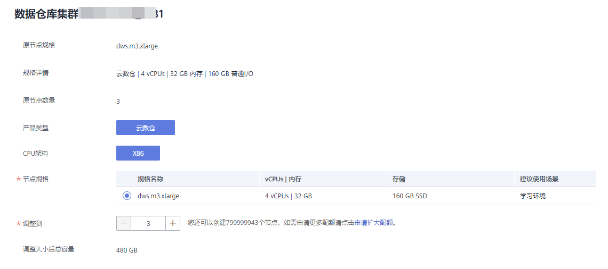
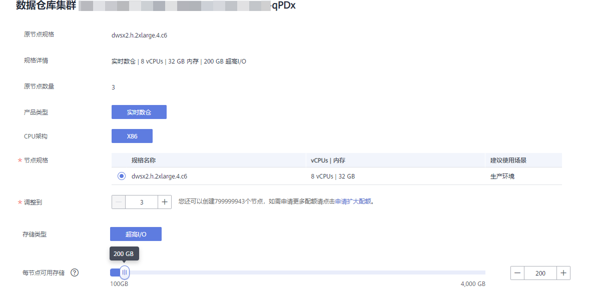
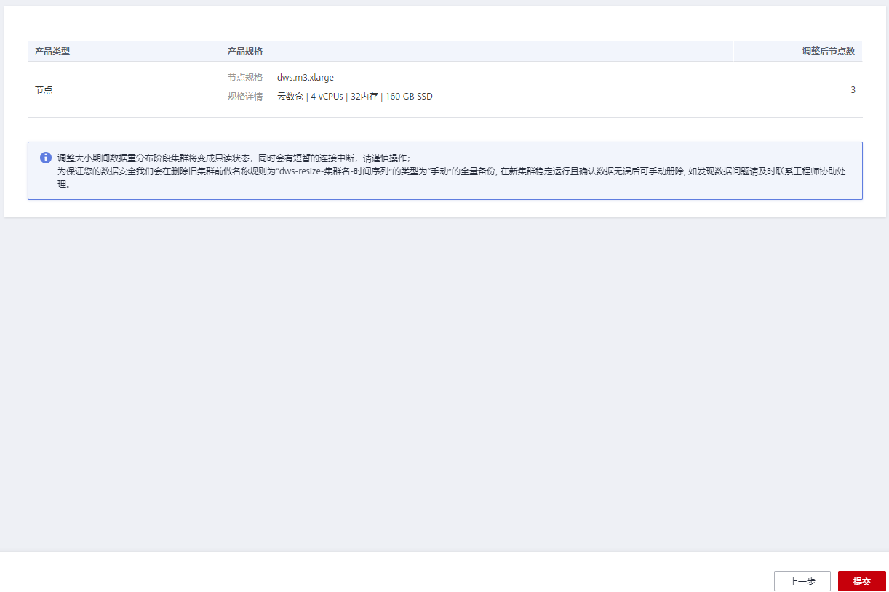

# 调整集群大小

随着用户对数据仓库容量和性能需求的变化，若当前环境不支持规格变更，却需要对当前集群规格进行调整，或者需要变更集群拓扑结构，您可以选择在控制台进行调整集群大小操作，以便充分利用GaussDB\(DWS\)提供的计算资源和存储资源。调整大小时会先创建一个目标规格的新集群，将现集群数据迁移到新集群上，最后将使用入口从老集群切换到新集群即完成调整大小操作，调整大小完成后会对老集群做全量快照，并且会保留老集群一段时间，用于特殊情况下的数据恢复。

> **说明：** 
>-   该特性仅8.1.3.200及以上集群版本支持。
>-   如果当前集群是包年/包月计费模式，将不支持该功能。
>-   在调整集群大小期间新集群是不计费的，当变更成功后开始计费。变更完成后老集群处于保留期，不再计费。
>-   调整大小功能目前仅支持云数仓。
>-   调整大小最大支持调整到240节点，且原节点数量加调整后节点数量不大于480节点。
>-   逻辑集群不支持调整大小。

## 调整大小对系统的影响

-   调整集群大小前，需退出创建了临时表的客户端连接，因为在调整大小过程中及调整大小成功之前创建的临时表将会失效，操作临时表也会失败。但是调整集群大小后创建的临时表不受影响。
-   调整集群大小过程中，进入数据重分布阶段集群将会变成“只读”状态。
-   调整集群大小后内网IP会变更，若使用到该IP需要更新。
-   为防止数据丢失，在变更完成后、删除老集群前会对老集群做一次全量快照（若不支持快照功能将跳过此步骤），可在快照列表中查看，确认无误后需手动删除快照。
-   调整集群大小过程中，集群只读会影响智能运维中相关运维任务的功能使用。建议在调整集群大小前，将智能运维任务暂停，或错开智能运维与调整集群大小的时间窗。

## 前提条件

-   请确定需要调整的集群处于“可用“、"只读"或“非均衡“任意一种状态。
-   请确定调整后的节点数小于等于用户节点数的剩余配额，否则系统会无法进行变更操作。
-   调整集群大小后的总容量至少大于原集群已使用量的1.2倍。
-   IAM子账号在进行调整集群大小前，需确保IAM子账号拥有VPC、EVC/BMS操作权限。

## 执行调整大小

1.  登录GaussDB\(DWS\) 管理控制台。
2.  单击“集群管理“。默认显示用户所有的集群列表。
3.  在集群列表中，在指定集群所在行的“操作“列，选择“更多\>调整大小“。系统将显示调整大小页面。
    -   在“节点规格“中可以选择一个当前集群支持调整的规格。

        > **说明：** 
        >调整后的集群与原集群的虚拟私有云、子网和安全组相同。

    -   在”调整到”中可以设置新集群的节点数量。

        

4.  如果集群规格磁盘大小可选择，还可以选择磁盘存储类型，以及每节点可用磁盘存储容量。

    

5.  确认无误后，单击“下一步：规格确认”。

    

6.  单击“提交”。
    -   提交调整大小申请后，集群的“任务信息”显示为“调整大小”，调整需要时间请耐心等待。
    -   调整过程中，集群会自动重启，因此会有一段时间“集群状态”显示为“不可用”，重启成功后“集群状态”会变成“可用”。调整期间会存在数据重分布，重分布过程中“集群状态”为“只读”。
    -   只有“集群状态”显示为“可用”且“任务信息”显示的“调整大小”结束，才表示调整成功，用户可以开始使用集群。
    -   如果集群的“任务信息”显示为“调整大小失败”，表示集群调整失败。
    -   如果调整大小失败后，再次单击“调整大小”提示需要重试，此时表示调整时可能由于集群本身状态或者网络原因等导致失败，请联系技术支持人员定位失败原因后再重试。

