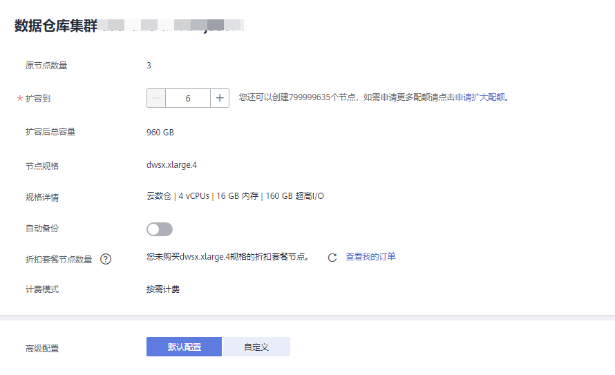

# 调整集群大小

随着您的数据仓库容量和性能需求的变化，您可以在管理控制台调整已有集群的大小，以便充分利用DWS提供的计算资源和存储资源。

-   对于集群版本在1.5.0以下的集群，只支持通过增加新节点来扩大集群容量，且新增加的节点规格与集群原节点的规格相同。具体操作步骤请参见[扩容集群](#section31992607155626)。
-   对于集群版本在1.5.0及以上的集群，支持通过调整节点个数或节点规格来调整集群的大小。具体操作步骤请参见[调整集群大小](#section12918122613613)。

> **说明：**   
>新增的节点默认是按需计费。用户可以再购买和新增节点个数和规格相同的包年包月套餐节点，这样新的节点也可以按照优惠价格收费。  

如果您是因集群存储容量不足而扩容集群，建议您在扩容前先执行vacuum清理和回收存储空间，DWS数据仓库中保存的数据在删除后，可能没有释放占用的磁盘空间形成脏数据，导致磁盘浪费。如果执行vacuum后，已使用存储容量仍然占用过高，您再进行扩容。VACUUM的语法请参见《数据仓库服务数据库开发指南》中的[VACUUM](https://support.huaweicloud.com/devg-dws/vacuum.html)章节。

## 调整集群大小对系统的影响

-   调整集群大小前，需退出创建了临时表的客户端连接，因为在调整集群大小过程中创建的临时表将会失效，操作临时表也会失败。但是，调整集群大小后创建的临时表不受影响。
-   在执行“调整大小“操作后，集群会进行一次自动快照，快照创建成功后进行集群调整大小。
-   正在调整集群大小的集群将禁用重启集群、调整大小、创建快照、重置集群管理员密码和删除集群的功能。
-   调整集群大小过程中，集群会自动重启，因此集群会有一段时间变为“不可用“状态，重启成功后集群变回“可用“状态。然后，在调整集群大小结束阶段，系统会将集群中用户数据在全部节点重新动态分布，重分布时，集群无法写入新数据，为“只读“状态。

    在重分布执行过程中，用户应当避免执行超过20分钟的查询（在重分布执行时申请写锁的默认时间为20分钟）。否则可能导致重分布出现等待加锁超时失败的问题。

-   调整集群大小后，如果集群创建新快照，将包含新增节点上的数据。
-   如果调整集群大小失败，数据库会在后台自动执行回滚操作，集群会恢复到调整集群大小前的节点个数。
    -   如果回滚成功，集群仍可以正常使用，用户可以重新执行“调整大小“操作，如果仍失败，请及时联系技术支持人员进行处理。
    -   如果数据库因为某些异常原因后台回滚失败，则集群可能会变为“不可用“状态，此时无法再执行“调整大小“或重启集群的操作，请及时联系技术支持人员进行处理。

## 前提条件

-   请确定需要调整大小的集群处于“可用“、“只读“或者“低性能“任意一种状态。
-   对于集群版本在1.5.0以下的集群，还需要确保满足如下条件：
    -   请确定需要扩容的集群当前节点数小于或等于“29“。

        如果需要扩容的集群当前节点数大于“29“，用户可以在管理控制台右上方单击“工单 \>  [新建工单](https://console.huaweicloud.com/ticket/#/ticketindex/createIndex)”，申请增加节点配额。一个集群最多支持256个节点。

    -   请确定计划扩容的节点数小于等于用户节点数的剩余配额，否则系统会提示无法进行扩容操作。用户可使用的节点数可在“集群管理“页面查看。

## 扩容集群

> **说明：**   
>-   扩容期间集群将变为只读状态，请谨慎操作。  
>-   为保证您的数据安全我们建议您在开始扩容操作之前创建手动快照。如何创建快照请参见[手动创建快照](手动创建快照.md)。  

对于集群版本在1.5.0以下的集群，目前只支持通过增加新节点来扩大集群容量，详细操作步骤如下：

1.  通过访问以下地址登录DWS管理控制台：[https://console.huaweicloud.com/dws](https://console.huaweicloud.com/dws)。
2.  单击“集群管理“。

    默认显示用户所有的集群列表。

3.  在集群列表中，在指定集群所在行的“操作“列，选择“更多  \>  扩容“。

    系统将显示扩容页面。

    **图 1**  扩容集群  
    

4.  在“扩容到“选择一个扩容后的节点数。
    -   扩容后的节点数量，在原节点数量的基础上，须至少增加3个节点，最多可增加的节点个数为节点剩余配额的最大值。并且，此处设置的扩容后的节点数量不能超过32个节点。

        如果可使用的节点配额不足，用户可以单击“申请更多配额“以提工单的形式申请更多节点配额。

        如果有符合业务需求的包年包月套餐的节点，建议先使用包年包月套餐节点，可以节约费用。如果没有，可以单击“购买包年包月套餐“进行购买。

    -   扩容增加的节点规格，默认与集群当前各节点的规格相同。
    -   扩容后的集群与原集群的虚拟私有云、子网和安全组也相同。

5.  单击“立即申请“。
6.  单击“提交“。
    -   提交扩容申请后，集群的“任务信息“显示为“节点扩容“，扩容需要时间请耐心等待。扩容过程中，集群会自动重启，因此会有一段时间“集群状态“显示为“不可用“，重启成功后“集群状态“会变成“可用“。然后，在扩容结束阶段，集群将重新分布数据，重分布过程中“集群状态“为“只读“。
    -   只有“集群状态“显示为“可用“且“任务信息“显示的“节点扩容“状态结束，才表示扩容成功，用户可以开始使用集群。
    -   如果集群的“任务信息“显示为“扩容失败“，表示集群扩容失败。

## 调整集群大小

> **说明：**   
>-   调整大小期间数据重分布阶段集群将变为只读状态，同时会有短暂的连接中断，请谨慎操作。  
>-   为保证您的数据安全我们建议您在开始扩容操作之前创建手动快照。如何创建快照请参见[手动创建快照](手动创建快照.md)。  

对于集群版本在1.5.0及以上的集群，支持通过调整节点个数或节点规格来调整集群的大小，即您可以增加或者减少集群的节点数量，也可以为集群选择新的节点规格，详细操作步骤如下：

1.  通过访问以下地址登录DWS管理控制台：[https://console.huaweicloud.com/dws](https://console.huaweicloud.com/dws)。
2.  单击“集群管理“。
3.  在集群列表中，找到需要调整大小的集群，单击其所在行的“更多  \>  调整大小“。

    系统将显示调整大小页面。

    **图 2**  调整集群大小  
    

4.  根据业务需求选择合适的节点规格，默认选择当前集群的原节点规格。
5.  在“调整到“参数中，设置调整后的集群节点数。
    -   集群最多可增加的节点个数为节点剩余配额的最大值。
    -   如果可使用的节点配额不足，用户可以单击“申请更多配额“以提工单的形式申请更多节点配额。

        如果有符合业务需求的包年包月套餐节点，建议先使用包年包月套餐节点，可以节约费用。如果没有，可以单击“购买包年包月套餐“进行购买。

    -   调整后的集群与原集群的虚拟私有云、子网和安全组也相同。

6.  单击“立即申请“。
7.  确认调整规格信息后，单击“提交“。
    -   提交调整集群大小申请后，DWS会先为集群创建一次自动快照，此时，集群的“任务信息“显示为“创建快照中“。
    -   快照创建成功后，开始调整集群大小，集群的“任务信息“显示为“调整大小“，调整集群大小需要时间请耐心等待。调整集群大小过程中，集群会自动重启，因此会有一段时间“集群状态“显示为“不可用“，重启成功后“集群状态“会变成“可用“。然后，在调整大小结束阶段，集群将重新分布数据，重分布过程中“集群状态“为“只读“。
    -   当集群在调整大小时，可以在集群列表中，单击正在调整大小的集群名称，进入集群详情页面查看集群的调整大小状态信息。调整大小状态包含如下信息：原节点个数、目标节点个数、调整大小状态、开始时间、原节点规格和目标节点规格。
    -   只有“集群状态“显示为“可用“且“任务信息“显示的“调整大小“状态结束，才表示调整集群大小成功，用户可以开始使用集群。
    -   如果集群的“任务信息“显示为“调整大小失败“，表示调整集群大小失败。

