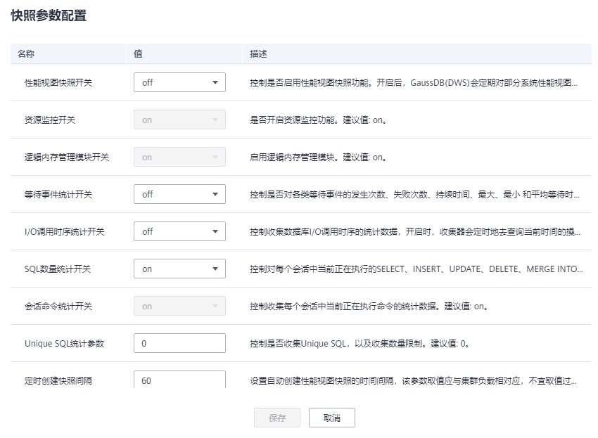

# 负荷信息快照

负荷信息快照页面展示了集群负荷信息快照的基础信息，支持手动触发创建及相关参数配置。

## 查看负荷信息快照

1.  登录GaussDB\(DWS\) 管理控制台。
2.  在“集群管理”页面，找到需要执行负荷分析的集群。
3.  在指定集群所在行的“操作”列，选择“监控面板”。系统将显示数据库监控页面。
4.  在左侧导航栏单击“负荷分析\>负荷信息快照”，右侧页面将展示负荷信息快照记录。

    

## 创建负荷信息快照

1.  登录GaussDB\(DWS\) 管理控制台。
2.  在“集群管理”页面，找到需要执行负荷分析的集群。
3.  在指定集群所在行的“操作”列，选择“监控面板”。系统将显示数据库监控页面。
4.  在左侧导航栏单击“负荷分析\>负荷信息快照”，进入负荷信息快照页面。
5.  单击“新建快照”，弹窗中填写快照名称，确认无误后，单击“确定”触发集群负荷信息快照创建。

    

    

    > **说明：** 
    >新建负荷信息快照时，确保负荷信息快照参数“性能视图快照开关”值设为 on ，具体步骤请参见[负荷信息快照参数配置](#section145915295112)。

## 负荷信息快照参数配置

1.  登录GaussDB\(DWS\) 管理控制台。
2.  在“集群管理”页面，找到需要负荷分析的集群。
3.  在指定集群所在行的“操作”列，选择“监控面板”。系统将显示数据库监控页面。
4.  在左侧导航栏单击“负荷分析\>负荷信息快照”，进入负荷信息快照页面。
5.  单击页面右上角的“快照参数配置”，用户可在弹窗中查看或修改相关GUC参数配置，详情请参见[表1](#table12934417177)。

    

**表 1**  负荷信息快照参数说明

<table><thead align="left"><tr id="row210134491716"><th class="cellrowborder" valign="top" width="36.81368136813681%" id="mcps1.2.4.1.1">
名称

</th>
<th class="cellrowborder" valign="top" width="14.541454145414543%" id="mcps1.2.4.1.2">
默认值

</th>
<th class="cellrowborder" valign="top" width="48.64486448644865%" id="mcps1.2.4.1.3">
描述

</th>
</tr>
</thead>
<tbody><tr id="row0101244151717"><td class="cellrowborder" valign="top" width="36.81368136813681%" headers="mcps1.2.4.1.1 ">
性能视图快照开关（enable_wdr_snapshot）

</td>
<td class="cellrowborder" valign="top" width="14.541454145414543%" headers="mcps1.2.4.1.2 ">
off

</td>
<td class="cellrowborder" valign="top" width="48.64486448644865%" headers="mcps1.2.4.1.3 ">
控制是否启用性能视图快照功能。开启后，GaussDB(DWS)会定期对部分系统性能视图创建快照并持久化保存，并接受手动创建快照请求。

</td>
</tr>
<tr id="row12101144161717"><td class="cellrowborder" valign="top" width="36.81368136813681%" headers="mcps1.2.4.1.1 ">
资源监控开关（enable_resource_track）

</td>
<td class="cellrowborder" valign="top" width="14.541454145414543%" headers="mcps1.2.4.1.2 ">
on

</td>
<td class="cellrowborder" valign="top" width="48.64486448644865%" headers="mcps1.2.4.1.3 ">
是否开启资源监控功能，只有在该参数打开的情况下资源统计相关的参数才起作用。

</td>
</tr>
<tr id="row0831446149"><td class="cellrowborder" valign="top" width="36.81368136813681%" headers="mcps1.2.4.1.1 ">
逻辑内存管理模块开关（enable_memory_limit）

</td>
<td class="cellrowborder" valign="top" width="14.541454145414543%" headers="mcps1.2.4.1.2 ">
on

</td>
<td class="cellrowborder" valign="top" width="48.64486448644865%" headers="mcps1.2.4.1.3 ">
启用逻辑内存管理模块。

</td>
</tr>
<tr id="row16107445175"><td class="cellrowborder" valign="top" width="36.81368136813681%" headers="mcps1.2.4.1.1 ">
等待事件统计开关（enable_track_wait_event）

</td>
<td class="cellrowborder" valign="top" width="14.541454145414543%" headers="mcps1.2.4.1.2 ">
off

</td>
<td class="cellrowborder" valign="top" width="48.64486448644865%" headers="mcps1.2.4.1.3 ">
控制是否对各类等待事件的发生次数、失败次数、持续时间、最大、最小 和平均等待时间等信息进行统计。

</td>
</tr>
<tr id="row191194431714"><td class="cellrowborder" valign="top" width="36.81368136813681%" headers="mcps1.2.4.1.1 ">
I/O调用时序统计开关（track_io_timing）

</td>
<td class="cellrowborder" valign="top" width="14.541454145414543%" headers="mcps1.2.4.1.2 ">
off

</td>
<td class="cellrowborder" valign="top" width="48.64486448644865%" headers="mcps1.2.4.1.3 ">
控制收集数据库I/O调用时序的统计数据，开启时，收集器会定时地去查询当前时间的操作系统， 这可能会引起某些平台的重大开销。

</td>
</tr>
<tr id="row1811154431711"><td class="cellrowborder" valign="top" width="36.81368136813681%" headers="mcps1.2.4.1.1 ">
SQL数量统计开关（track_sql_count）

</td>
<td class="cellrowborder" valign="top" width="14.541454145414543%" headers="mcps1.2.4.1.2 ">
8.1.3以下的版本默认值为off，8.1.3及以上的版本默认值为on

</td>
<td class="cellrowborder" valign="top" width="48.64486448644865%" headers="mcps1.2.4.1.3 ">
控制对每个会话中当前正在执行的SELECT、INSERT、UPDATE、DELETE、MERGE INTO语句是否进行计数统计，对SELECT、INSERT、UPDATE、DELETE语句进行响应时间的统计，以及对DDL、DML、DCL语句进行计数的统计。其生效前置条件为会话命令统计开关（track_activities）值为on。

</td>
</tr>
<tr id="row1611204416174"><td class="cellrowborder" valign="top" width="36.81368136813681%" headers="mcps1.2.4.1.1 ">
会话命令统计开关（track_activities）

</td>
<td class="cellrowborder" valign="top" width="14.541454145414543%" headers="mcps1.2.4.1.2 ">
on

</td>
<td class="cellrowborder" valign="top" width="48.64486448644865%" headers="mcps1.2.4.1.3 ">
控制收集每个会话中当前正在执行命令的统计数据。

</td>
</tr>
<tr id="row81114447174"><td class="cellrowborder" valign="top" width="36.81368136813681%" headers="mcps1.2.4.1.1 ">
Unique SQL统计参数（instr_unique_sql_count）

</td>
<td class="cellrowborder" valign="top" width="14.541454145414543%" headers="mcps1.2.4.1.2 ">
0

</td>
<td class="cellrowborder" valign="top" width="48.64486448644865%" headers="mcps1.2.4.1.3 ">
控制是否收集Unique SQL，以及收集数量限制。

</td>
</tr>
<tr id="row1911144416171"><td class="cellrowborder" valign="top" width="36.81368136813681%" headers="mcps1.2.4.1.1 ">
定时创建快照间隔（wdr_snapshot_interval）

</td>
<td class="cellrowborder" valign="top" width="14.541454145414543%" headers="mcps1.2.4.1.2 ">
60

</td>
<td class="cellrowborder" valign="top" width="48.64486448644865%" headers="mcps1.2.4.1.3 ">
设置自动创建性能视图快照的时间间隔，该参数取值应与集群负载相对应，不宜取值过小，建议大于创建一次快照所需时间。单位为分钟。

</td>
</tr>
<tr id="row161254491717"><td class="cellrowborder" valign="top" width="36.81368136813681%" headers="mcps1.2.4.1.1 ">
快照保存时长（wdr_snapshot_retention_days）

</td>
<td class="cellrowborder" valign="top" width="14.541454145414543%" headers="mcps1.2.4.1.2 ">
8

</td>
<td class="cellrowborder" valign="top" width="48.64486448644865%" headers="mcps1.2.4.1.3 ">
设置性能快照数据保留的最大天数，该参数取值应与可用磁盘空间相对应，取值越大，需要的磁盘空间越大。单位为天。

</td>
</tr>
</tbody>
</table>

