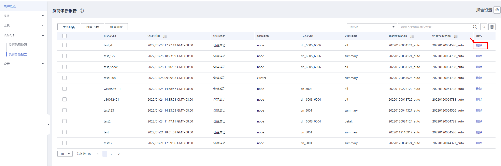

# 负荷诊断报告

负荷诊断报告页面展示了历史负荷诊断报告记录，并支持诊断报告的创建、下载和删除。

> **说明：** 
>新增负荷报告操作需要用户有相应OBS桶权限。

## 查看负荷诊断报告

1.  登录GaussDB\(DWS\) 管理控制台。
2.  在“集群管理”页面，找到需要负荷分析的集群。
3.  在指定集群所在行的“操作”列，选择“监控面板”。系统将显示数据库监控页面。
4.  在左侧导航栏单击“负荷分析\>负荷诊断报告”，右侧页面将展示负荷诊断报告记录。

    

## 生成负荷诊断报告

1.  登录GaussDB\(DWS\) 管理控制台。
2.  在“集群管理”页面，找到需要负荷分析的集群。
3.  在指定集群所在行的“操作”列，选择“监控面板”。系统将显示数据库监控页面。
4.  在左侧导航栏单击“负荷分析\>负荷诊断报告”，进入负荷诊断报告页面。
5.  单击页面中“生成报告”按钮，在弹窗中按提示填写或选择信息，确认无误后单击“确定”，触发报告创建。

    -   报告名称：自定义（用户需确保名称唯一性，可由数字、字母和下划线组成，要求在100字符以内）。
    -   对象类型：
        -   node：提供指定节点的性能数据。
        -   cluster：提供整个集群的性能数据。

    -   节点名称：自定义选择。
    -   内容类型：
        -   summary：摘要型，包括简要分析计算结果。
        -   detail：详细型，包含详细的指标数据。
        -   all：全部型，包括摘要型和详细型的全部内容。

    -   起始快照名称：自定义选择。
    -   结束快照名称：自定义选择。
    -   OBS桶：桶名称，自定义选择，用于存储报告。
    -   OBS路径：存储目录，自定义填写（多级目录可用“/”进行分隔，不能以“/”开头。取值范围：1\~50个字符）。

    

    

    

    > **说明：** 
    >起始快照时间必须早于结束快照时间。

## 批量下载负荷诊断报告

1.  登录GaussDB\(DWS\) 管理控制台。
2.  在“集群管理”页面，找到需要负荷分析的集群。
3.  在指定集群所在行的“操作”列，选择“监控面板”。系统将显示数据库监控页面。
4.  在左侧导航栏单击“负荷分析\>负荷诊断报告”，进入负荷诊断报告页面。
5.  选中需要导出的报告记录，单击“批量下载”进行报告文件的下载。

    

    > **说明：** 
    >报告记录下载限制最大批量值为10。

## 批量删除负荷诊断报告

1.  登录GaussDB\(DWS\) 管理控制台。
2.  在“集群管理”页面，找到需要负荷分析的集群。
3.  在指定集群所在行的“操作”列，选择“监控面板”。系统将显示数据库监控页面。
4.  在左侧导航栏单击“负荷分析\>负荷诊断报告”，进入负荷诊断报告页面。
5.  选中需要删除的报告记录，单击“批量删除”进行报告记录和文件的删除。

    

## 删除指定负荷诊断报告

1.  登录GaussDB\(DWS\) 管理控制台。
2.  在“集群管理”页面，找到需要负荷分析的集群。
3.  在指定集群所在行的“操作”列，选择“监控面板”。系统将显示数据库监控页面。
4.  在左侧导航栏单击“负荷分析\>负荷诊断报告”，进入负荷诊断报告页面。
5.  单击指定报告“操作”列中的“删除”按钮进行报告记录和文件的删除。

    

## 负荷诊断报告相关参数配置

1.  登录GaussDB\(DWS\) 管理控制台。
2.  在“集群管理”页面，找到需要负荷分析的集群。
3.  在指定集群所在行的“操作”列，选择“监控面板”。系统将显示数据库监控页面。
4.  在左侧导航栏单击“负荷分析\>负荷诊断报告”，进入负荷诊断报告页面。
5.  单击右上角“报告设置”按钮，在弹窗中设置报告记录保存时间以及OBS相关配置。

    

