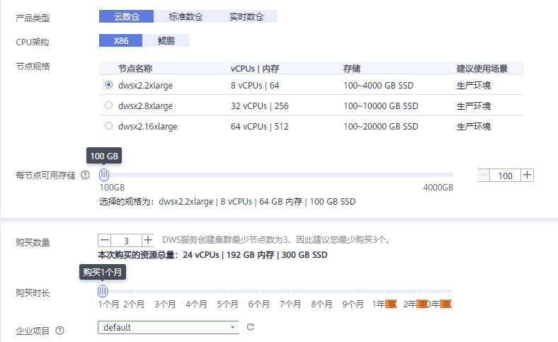

# 购买折扣套餐

GaussDB\(DWS\) 同时提供折扣套餐的计费模式，根据服务购买时长，一次性支付费用。最短时长为1个月，最长时长为3年。这种购买方式相对比较优惠，对于长期使用者，推荐该方式。

> **须知：** 
>-   折扣套餐购买成功后系统不会自动创建集群。您需要前往GaussDB\(DWS\)管理控制台自行创建集群，具体操作步骤请参见[创建集群](创建集群.md)章节。
>-   购买云数仓折扣套餐总容量为：节点数量\*每节点可用存储\*2（主+备）\*24小时\*购买时长（天），其中一个月按30天计算。若用户创建的集群容量超过购买的折扣套餐总容量时将自动转为按需计费模式。
>-   如果您已经先创建了集群，然后才购买与集群相同区域和节点规格的折扣套餐，折扣套餐买完之后就会自动关联到已购买的集群。
>-   折扣套餐所购买的时长到期后，将自动转为按需计费模式，集群不会被自动释放。
>-   关于折扣套餐的详细说明，请参见[GaussDB\(DWS\)价格详情](https://www.huaweicloud.com/pricing.html?tab=detail#/dws)。

本章节为您介绍如何以折扣套餐的方式购买GaussDB\(DWS\) 服务。

## 购买折扣套餐

1.  登录GaussDB\(DWS\) 管理控制台。
2.  单击“购买折扣套餐”。
3.  在“购买折扣套餐”页面，选择“区域”。

    **表 1**  区域参数说明

    
    <table><thead align="left"><tr id="rfa01c767f5684d32851adf906142846c"><th class="cellrowborder" valign="top" width="21.62%" id="mcps1.2.4.1.1">
<strong id="zh-cn_topic_0106894116_b314125603616">参数名</strong>

    </th>
    <th class="cellrowborder" valign="top" width="53.76%" id="mcps1.2.4.1.2">
<strong id="a9b102674b02f4ccc82a59d287766238a">参数解释</strong>

    </th>
    <th class="cellrowborder" valign="top" width="24.62%" id="mcps1.2.4.1.3">
<strong id="a4650b68b44aa42e08951933a73cd2a2a">样例值</strong>

    </th>
    </tr>
    </thead>
    <tbody><tr id="re3dd4764f5ce49068ba57cb66cc232c5"><td class="cellrowborder" valign="top" width="21.62%" headers="mcps1.2.4.1.1 ">
区域

    </td>
    <td class="cellrowborder" valign="top" width="53.76%" headers="mcps1.2.4.1.2 ">
选择集群节点实际工作区域。

    
不同的区域之间折扣套餐不互通，每个区域需分别购买，请根据您的实际需求慎重选择。

    
有关区域的详细信息，请参见<a href="https://developer.huaweicloud.com/endpoint?DWS" target="_blank" rel="noopener noreferrer">地区和终端节点</a>。

    </td>
    <td class="cellrowborder" valign="top" width="24.62%" headers="mcps1.2.4.1.3 ">
华北-北京四

    </td>
    </tr>
    </tbody>
    </table>

4.  设置以下集群相关参数，然后在页面底部，将显示相应集群配置的“参考价格“。您可以单击“了解计费详情“，查看具体的计费详情。

    **图 1**  选择集群规格  
    

    **表 2**  规格参数说明

    
    <table><thead align="left"><tr id="r75255b05001a4ca6b5eacc809115f1a4"><th class="cellrowborder" valign="top" width="18%" id="mcps1.2.4.1.1">
<strong id="a337117c7ef4b4a079968a18a10d7f79e">参数名</strong>

    </th>
    <th class="cellrowborder" valign="top" width="61.09%" id="mcps1.2.4.1.2">
<strong id="zh-cn_topic_0106894116_b75435223442">参数解释</strong>

    </th>
    <th class="cellrowborder" valign="top" width="20.91%" id="mcps1.2.4.1.3">
<strong id="a3686363507cf4d0fb4247acc484d45ff">样例值</strong>

    </th>
    </tr>
    </thead>
    <tbody><tr id="row6934112419409"><td class="cellrowborder" valign="top" width="18%" headers="mcps1.2.4.1.1 ">
产品类型

    </td>
    <td class="cellrowborder" valign="top" width="61.09%" headers="mcps1.2.4.1.2 ">
产品类型有：

    <ul id="zh-cn_topic_0000001098656914_ul08014320225"><li><strong id="zh-cn_topic_0000001098656914_b107901840111812">云数仓</strong>：针对使用EVS盘的规格，支持用户在可选范围内自定义集群使用的存储类型与存储容量；话单计费上，第二代EVS盘规格采用存储资源独立计费的方式。</li><li><strong id="zh-cn_topic_0000001098656914_b72468719186">标准数仓</strong>：OLAP，支持10PB级超大规模数据在线查询、离线分析能力，可扩展至1024节点。不支持用户自定义存储类型与存储容量。</li><li><strong id="zh-cn_topic_0000001098656914_b1467632951013">实时数仓</strong>：提供时序计算和时序压缩服务。</li></ul>
    
 说明： 

对于BMS、本地盘非EVS存储的规格，创建集群时不支持用户自定义存储类型和存储容量，与当前版本能力一致，只支持用户选择规格类型。

    

    </td>
    <td class="cellrowborder" valign="top" width="20.91%" headers="mcps1.2.4.1.3 ">
云数仓

    </td>
    </tr>
    <tr id="row19971714204111"><td class="cellrowborder" valign="top" width="18%" headers="mcps1.2.4.1.1 ">
CPU架构

    </td>
    <td class="cellrowborder" valign="top" width="61.09%" headers="mcps1.2.4.1.2 ">
CPU架构有：

    <ul id="ul338334344118"><li><strong id="a0097482a29074b2eb73d2d4e6ddec336">X86</strong></li><li><strong id="af8d4e50a3b90480a9d3ab767f251f303">鲲鹏</strong></li></ul>
    </td>
    <td class="cellrowborder" valign="top" width="20.91%" headers="mcps1.2.4.1.3 ">
X86

    </td>
    </tr>
    <tr id="r107a43c0c19c47a7be3eeeebf938ece0"><td class="cellrowborder" valign="top" width="18%" headers="mcps1.2.4.1.1 ">
节点规格

    </td>
    <td class="cellrowborder" valign="top" width="61.09%" headers="mcps1.2.4.1.2 ">
请根据业务需求合理选择节点类型。在节点类型列表中展示了每一种节点类型单个节点的vCPU、内存、存储、I/O、并发队列数和建议使用场景。其中，“并发队列数”是系统支持最大限度的并发作业数，与规格强相关。

    
GaussDB(DWS) 支持的节点类型及其价格详情，请参见<a href="https://www.huaweicloud.com/pricing.html?tab=detail#/dws" target="_blank" rel="noopener noreferrer">GaussDB(DWS)价格详情</a>。

    </td>
    <td class="cellrowborder" valign="top" width="20.91%" headers="mcps1.2.4.1.3 ">
dws.m6.4xlarge.8

    </td>
    </tr>
    <tr id="row196433213448"><td class="cellrowborder" valign="top" width="18%" headers="mcps1.2.4.1.1 ">
每节点可用存储（云数仓参数）

    </td>
    <td class="cellrowborder" valign="top" width="61.09%" headers="mcps1.2.4.1.2 ">
每节点可用存储容量。

    
 说明： 

您申请的存储空间会有必要的文件系统开销，这些开销包括索引节点，以及数据库运行必须的空间。存储空间的数值必须为100的整倍数。

    

    </td>
    <td class="cellrowborder" valign="top" width="20.91%" headers="mcps1.2.4.1.3 ">
-

    </td>
    </tr>
    <tr id="rdf9a4e04485c4b11b2caa5792ba0811d"><td class="cellrowborder" valign="top" width="18%" headers="mcps1.2.4.1.1 ">
购买数量

    </td>
    <td class="cellrowborder" valign="top" width="61.09%" headers="mcps1.2.4.1.2 ">
选择集群中的节点个数。

    
如果您是首次购买，建议您购买至少3个节点，因为GaussDB(DWS) 集群最小规模为3个节点。

    
如果您非首次购买，则根据您的实际需要选择节点数即可。

    </td>
    <td class="cellrowborder" valign="top" width="20.91%" headers="mcps1.2.4.1.3 ">
3

    </td>
    </tr>
    <tr id="row1239880379"><td class="cellrowborder" valign="top" width="18%" headers="mcps1.2.4.1.1 ">
购买时长

    </td>
    <td class="cellrowborder" valign="top" width="61.09%" headers="mcps1.2.4.1.2 ">
拖动“购买时长”的滑块，确定购买时长。

    
在页面底部，将显示“参考价格”，您可以单击“了解计费详情”，在弹出的“产品价格详情”页面中，查看具体的计费详情。

    </td>
    <td class="cellrowborder" valign="top" width="20.91%" headers="mcps1.2.4.1.3 ">
-

    </td>
    </tr>
    <tr id="row15194945815"><td class="cellrowborder" valign="top" width="18%" headers="mcps1.2.4.1.1 ">
企业项目

    </td>
    <td class="cellrowborder" valign="top" width="61.09%" headers="mcps1.2.4.1.2 ">
集群所属的企业项目。已开通企业项目管理服务的用户才可以配置该参数。默认值为default。

    
企业项目是一种云资源管理方式，企业项目管理服务提供统一的云资源按项目管理，以及项目内的资源管理、成员管理。

    
您可以选择默认的企业项目“default”或其他已有的企业项目。如果要创建新的企业项目，请登录企业管理控制台进行创建，详细操作请参考《企业管理用户指南》。

    </td>
    <td class="cellrowborder" valign="top" width="20.91%" headers="mcps1.2.4.1.3 ">
default

    </td>
    </tr>
    </tbody>
    </table>

    > **说明：** 
    >折扣套餐节点和具体的区域、节点规格绑定，当您购买的折扣套餐和您运行的集群节点的区域和规格完全一致时，才能在实际计费时享受优惠。

5.  单击“立即购买“，进入订单详情确认页面。
6.  订单详情确认无误后，单击“去支付”。
7.  选择支付方式，根据页面提示完成付款。

    付款成功后，一般需要等待5分钟左右订单才能生效，订单生效后您才可以使用所购买的套餐包。您可以选择控制台右上方的菜单“费用 \> 我的订单“，进入“我的订单“页面查看订单状态。

    折扣套餐购买成功后系统不会自动创建集群。如果您尚未创建集群，需前往[GaussDB\(DWS\)管理控制台](https://console.huaweicloud.com/dws)自行创建，具体操作步骤请参见[创建集群](创建集群.md)章节。

    订单生效后，您再创建GaussDB\(DWS\) 集群时，若所选集群规格与所购买的套餐包集群规格相同，集群就会自动关联折扣套餐。折扣节点数量范围内的节点在折扣套餐订单有效期内将不再另外收费（因为您前期购买折扣套餐时已经支付过费用），若所选的集群节点数量超过折扣节点数量，超过的部分按需计费。

