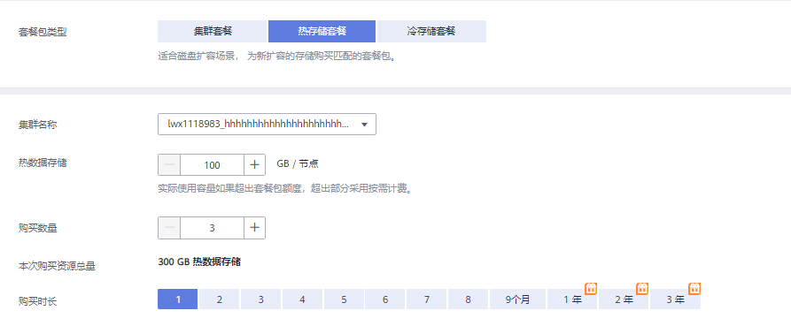

# 购买折扣套餐

GaussDB\(DWS\) 同时提供折扣套餐的计费模式，根据服务购买时长，一次性支付费用。最短时长为1个月，最长时长为3年。这种购买方式相对比较优惠，对于长期使用者，推荐该方式。

> **须知：** 
>-   不推荐购买此套餐。
>-   折扣套餐购买成功后系统不会自动创建集群。您需要前往GaussDB\(DWS\)管理控制台自行创建集群，具体操作步骤请参见[创建集群](创建集群.md)章节。
>-   购买云数仓折扣套餐总容量为：节点数量\*每节点可用存储\*2（主+备）\*24小时\*购买时长（天），其中一个月按30天计算。若用户创建的集群容量超过购买的折扣套餐总容量时将自动转为按需计费模式。
>-   折扣套餐包以月为单位进行重置的，例如用户在10月1日购买了100G的年套餐包，那么在11月1日会进行重置，进入下一个周期即11月1日-12月1日，以此类推，直至用完一年。
>-   已经购买的折扣套餐包不支持直接更改套餐包类型，例如包月套餐包不能直接更改为包年套餐包，但可以在包月套餐包到期时重新购买新的包年套餐包，集群会自动关联到新的套餐包。
>-   如果您已经先创建了集群，然后才购买与集群相同区域和节点规格的折扣套餐，折扣套餐买完之后就会自动关联到已购买的集群。
>-   折扣套餐所购买的时长到期后，将自动转为按需计费模式，集群不会被自动释放。
>-   折扣套餐包到期前15、7、3、1天，汇总发通知告知客户去续费。
>-   关于折扣套餐的详细说明，请参见[GaussDB\(DWS\)价格详情](https://www.huaweicloud.com/pricing.html?tab=detail#/dws)。
>-   如果您的集群规格（或者多个集群具有相同规格）都与购买折扣套餐时选择的规格相同，折扣套餐会随机关联对应集群。
>-   如果用户进行了增加节点或磁盘扩容等操作，则需为新扩的节点或磁盘重新购买对应的套餐包。若不购买，会默认按照按需计费。
>-   购买折扣套餐且创建集群后，如需转包周期，折扣套餐会重新关联集群，详细说明请参见[包年/包月计费操作](https://support.huaweicloud.com/mgtg-dws/dws_01_0827.html)中“按需转包年/包月”操作。

本章节为您介绍如何以折扣套餐的方式购买GaussDB\(DWS\) 服务。

## 购买折扣套餐

1.  登录GaussDB\(DWS\) 管理控制台。
2.  单击“购买折扣套餐”。
3.  在“购买折扣套餐”页面，选择“区域”。

    **表 1**  区域参数说明

    
    <table><thead align="left"><tr id="zh-cn_topic_0000001180440197_rfa01c767f5684d32851adf906142846c"><th class="cellrowborder" valign="top" width="21.62%" id="mcps1.2.4.1.1">
<strong id="zh-cn_topic_0000001180440197_zh-cn_topic_0106894116_b314125603616">参数名</strong>

    </th>
    <th class="cellrowborder" valign="top" width="53.76%" id="mcps1.2.4.1.2">
<strong id="zh-cn_topic_0000001180440197_a9b102674b02f4ccc82a59d287766238a">参数解释</strong>

    </th>
    <th class="cellrowborder" valign="top" width="24.62%" id="mcps1.2.4.1.3">
<strong id="zh-cn_topic_0000001180440197_a4650b68b44aa42e08951933a73cd2a2a">样例值</strong>

    </th>
    </tr>
    </thead>
    <tbody><tr id="zh-cn_topic_0000001180440197_re3dd4764f5ce49068ba57cb66cc232c5"><td class="cellrowborder" valign="top" width="21.62%" headers="mcps1.2.4.1.1 ">
区域

    </td>
    <td class="cellrowborder" valign="top" width="53.76%" headers="mcps1.2.4.1.2 ">
选择集群节点实际工作区域。

    
不同的区域之间折扣套餐不互通，每个区域需分别购买，请根据您的实际需求慎重选择。

    
有关区域的详细信息，请参见<a href="https://developer.huaweicloud.com/endpoint?DWS" target="_blank" rel="noopener noreferrer">地区和终端节点</a>。

    </td>
    <td class="cellrowborder" valign="top" width="24.62%" headers="mcps1.2.4.1.3 ">
华北-北京四

    </td>
    </tr>
    </tbody>
    </table>

4.  折扣套餐类型选择为“集群套餐”时，设置以下集群相关参数，然后在页面底部，将显示相应集群配置的“参考价格“。您可以单击“了解计费详情“，查看具体的计费详情。集群套餐适用于新购买集群、节点扩容场景，为新创建资源购买匹配的套餐包。

    

    **表 2**  规格参数说明

    
    <table><thead align="left"><tr id="zh-cn_topic_0000001180440197_r75255b05001a4ca6b5eacc809115f1a4"><th class="cellrowborder" valign="top" width="18%" id="mcps1.2.4.1.1">
<strong id="zh-cn_topic_0000001180440197_a337117c7ef4b4a079968a18a10d7f79e">参数名</strong>

    </th>
    <th class="cellrowborder" valign="top" width="61.09%" id="mcps1.2.4.1.2">
<strong id="zh-cn_topic_0000001180440197_zh-cn_topic_0106894116_b75435223442">参数解释</strong>

    </th>
    <th class="cellrowborder" valign="top" width="20.91%" id="mcps1.2.4.1.3">
<strong id="zh-cn_topic_0000001180440197_a3686363507cf4d0fb4247acc484d45ff">样例值</strong>

    </th>
    </tr>
    </thead>
    <tbody><tr id="zh-cn_topic_0000001180440197_row6934112419409"><td class="cellrowborder" valign="top" width="18%" headers="mcps1.2.4.1.1 ">
产品类型

    </td>
    <td class="cellrowborder" valign="top" width="61.09%" headers="mcps1.2.4.1.2 ">
产品类型有：

    <ul id="zh-cn_topic_0000001455917053_ul149771132010"><li><strong id="zh-cn_topic_0000001455917053_zh-cn_topic_0000001199117258_b107901840111812">云数仓</strong>：高性价比，支持冷热数据分析，存储、计算弹性伸缩，无限算力、无限容量，并按需、按量计价。适用于“库、仓、市、湖”一体化的融合分析业务，是OLAP分析场景的首选。</li></ul>
    <ul id="zh-cn_topic_0000001455917053_ul69101028172716"><li><strong id="zh-cn_topic_0000001455917053_zh-cn_topic_0000001199117258_b06975458289">IoT数仓</strong>：在云数仓基础上，提供高效的时序计算和IoT分析能力，支持实时和历史数据关联，内置时序算子，最高40x压缩。适用于物联网IoT等实时分析场景。</li><li><strong id="zh-cn_topic_0000001455917053_zh-cn_topic_0000001199117258_b1330615338253">实时数仓</strong>：在大规模数据查询和分析能力基础上，提供高并发、高性能、低时延、低成本的事务处理能力。适用于HTAP混合负载场景，“一库两用，生产即分析”，支持单机部署和集群部署两种部署方式。</li></ul>
    
 说明： 
<ul id="zh-cn_topic_0000001455917053_ul16912428162711"><li>创建实时数仓时，用户可根据需求选择集群部署或单机部署：<ul id="zh-cn_topic_0000001455917053_ul711010294533"><li>集群部署：创建集群时可选择带有h的节点规格（例如：dwsx2.h.4xlarge.4.c6），此时实时数仓支持集群部署，支持节点扩容、资源池等功能。</li><li>单机部署：创建集群时可选择带有h1的节点规格（例如：dwsx2.h1.xlarge.2.c6），此时实时数仓只支持单机部署，单机形态不提供高可用服务，因此存储成本可减半，单机模式服务可用性通过ECS自动重建实现，数据可靠性通过EVS多副本机制保证。单机形态性价比更高，建议用于轻量化业务。</li></ul>
    </li></ul>
    

    </td>
    <td class="cellrowborder" valign="top" width="20.91%" headers="mcps1.2.4.1.3 ">
云数仓

    </td>
    </tr>
    <tr id="row1743020252210"><td class="cellrowborder" valign="top" width="18%" headers="mcps1.2.4.1.1 ">
计算类型

    </td>
    <td class="cellrowborder" valign="top" width="61.09%" headers="mcps1.2.4.1.2 ">
计算类型有：

    <ul id="ul79516483716"><li>弹性云服务器</li><li>BMS裸金属</li></ul>
    </td>
    <td class="cellrowborder" valign="top" width="20.91%" headers="mcps1.2.4.1.3 ">
-

    </td>
    </tr>
    <tr id="row157311429723"><td class="cellrowborder" valign="top" width="18%" headers="mcps1.2.4.1.1 ">
存储类型

    </td>
    <td class="cellrowborder" valign="top" width="61.09%" headers="mcps1.2.4.1.2 ">
存储类型有：

    <ul id="ul319917511710"><li>SSD云盘</li><li>SSD本地盘</li></ul>
    </td>
    <td class="cellrowborder" valign="top" width="20.91%" headers="mcps1.2.4.1.3 ">
-

    </td>
    </tr>
    <tr id="zh-cn_topic_0000001180440197_row19971714204111"><td class="cellrowborder" valign="top" width="18%" headers="mcps1.2.4.1.1 ">
CPU架构

    </td>
    <td class="cellrowborder" valign="top" width="61.09%" headers="mcps1.2.4.1.2 ">
CPU架构有：

    <ul id="zh-cn_topic_0000001180440197_ul338334344118"><li><strong id="zh-cn_topic_0000001180440197_a0097482a29074b2eb73d2d4e6ddec336">X86</strong></li><li><strong id="zh-cn_topic_0000001180440197_af8d4e50a3b90480a9d3ab767f251f303">鲲鹏</strong></li></ul>
    </td>
    <td class="cellrowborder" valign="top" width="20.91%" headers="mcps1.2.4.1.3 ">
X86

    </td>
    </tr>
    <tr id="zh-cn_topic_0000001180440197_r107a43c0c19c47a7be3eeeebf938ece0"><td class="cellrowborder" valign="top" width="18%" headers="mcps1.2.4.1.1 ">
节点规格

    </td>
    <td class="cellrowborder" valign="top" width="61.09%" headers="mcps1.2.4.1.2 ">
请根据业务需求合理选择节点类型。在节点类型列表中展示了每一种节点类型单个节点的vCPU、内存、存储、I/O、并发队列数和建议使用场景。其中，“并发队列数”是系统支持最大限度的并发作业数，与规格强相关。

    
GaussDB(DWS) 支持的节点类型其价格详情，请参见<a href="https://www.huaweicloud.com/pricing.html?tab=detail#/dws" target="_blank" rel="noopener noreferrer">GaussDB(DWS)价格详情</a>。

    
GaussDB(DWS)支持的节点规格详情，请参见<a href="https://support.huaweicloud.com/productdesc-dws/dws_01_00018.html" target="_blank" rel="noopener noreferrer">数据仓库规格</a>。

    </td>
    <td class="cellrowborder" valign="top" width="20.91%" headers="mcps1.2.4.1.3 ">
dws.m6.4xlarge.8

    </td>
    </tr>
    <tr id="zh-cn_topic_0000001180440197_row196433213448"><td class="cellrowborder" valign="top" width="18%" headers="mcps1.2.4.1.1 ">
热数据存储

    </td>
    <td class="cellrowborder" valign="top" width="61.09%" headers="mcps1.2.4.1.2 ">
每节点可用存储容量。

    
 说明： 

您申请的存储空间会有必要的文件系统开销，这些开销包括索引节点，以及数据库运行必须的空间。存储空间的数值必须为100的整倍数。

    

    </td>
    <td class="cellrowborder" valign="top" width="20.91%" headers="mcps1.2.4.1.3 ">
-

    </td>
    </tr>
    <tr id="zh-cn_topic_0000001180440197_rdf9a4e04485c4b11b2caa5792ba0811d"><td class="cellrowborder" valign="top" width="18%" headers="mcps1.2.4.1.1 ">
购买数量

    </td>
    <td class="cellrowborder" valign="top" width="61.09%" headers="mcps1.2.4.1.2 ">
选择集群中的节点个数。

    
如果您是首次购买，建议您购买至少3个节点，因为GaussDB(DWS) 集群最小规模为3个节点。

    
如果您非首次购买，则根据您的实际需要选择节点数即可。

    </td>
    <td class="cellrowborder" valign="top" width="20.91%" headers="mcps1.2.4.1.3 ">
3

    </td>
    </tr>
    <tr id="row9429152617613"><td class="cellrowborder" valign="top" width="18%" headers="mcps1.2.4.1.1 ">
资源总量

    </td>
    <td class="cellrowborder" valign="top" width="61.09%" headers="mcps1.2.4.1.2 ">
显示集群的总容量。

    
各个规格对应的存储容量均为数据库存储数据的实际空间，所展示存储容量已扣除副本、RAID所消耗的磁盘空间。

    </td>
    <td class="cellrowborder" valign="top" width="20.91%" headers="mcps1.2.4.1.3 ">
-

    </td>
    </tr>
    <tr id="zh-cn_topic_0000001180440197_row1239880379"><td class="cellrowborder" valign="top" width="18%" headers="mcps1.2.4.1.1 ">
购买时长

    </td>
    <td class="cellrowborder" valign="top" width="61.09%" headers="mcps1.2.4.1.2 ">
拖动“购买时长”的滑块，确定购买时长。

    
在页面底部，将显示“参考价格”，您可以单击“了解计费详情”，在弹出的“产品价格详情”页面中，查看具体的计费详情。

    </td>
    <td class="cellrowborder" valign="top" width="20.91%" headers="mcps1.2.4.1.3 ">
-

    </td>
    </tr>
    </tbody>
    </table>

    > **说明：** 
    >折扣套餐节点和具体的区域、节点规格绑定，当您购买的折扣套餐和您运行的集群节点的区域、规格完全一致时，才能在实际计费时享受优惠。

5.  折扣套餐类型选择为“热存储套餐”时，设置以下集群相关参数，然后在页面底部，将显示相应集群配置的“参考价格“。您可以单击“了解计费详情“，查看具体的计费详情。热存储套餐包适用于磁盘扩容场景，为新扩容的存储购买匹配的套餐包。

    

    **表 3**  参数说明

    
    <table><thead align="left"><tr id="zh-cn_topic_0000001180440197_row457214387919"><th class="cellrowborder" valign="top" width="17.57175717571757%" id="mcps1.2.4.1.1">
参数名

    </th>
    <th class="cellrowborder" valign="top" width="60.7960796079608%" id="mcps1.2.4.1.2">
参数解释

    </th>
    <th class="cellrowborder" valign="top" width="21.632163216321633%" id="mcps1.2.4.1.3">
样例值

    </th>
    </tr>
    </thead>
    <tbody><tr id="row1656811121316"><td class="cellrowborder" valign="top" width="17.57175717571757%" headers="mcps1.2.4.1.1 ">
集群名称

    </td>
    <td class="cellrowborder" valign="top" width="60.7960796079608%" headers="mcps1.2.4.1.2 ">
下拉框，显示用户已创建的集群，用户可根据自身需求选择相应集群购买匹配的套餐包。

    </td>
    <td class="cellrowborder" valign="top" width="21.632163216321633%" headers="mcps1.2.4.1.3 ">
-

    </td>
    </tr>
    <tr id="zh-cn_topic_0000001180440197_row18572203812911"><td class="cellrowborder" valign="top" width="17.57175717571757%" headers="mcps1.2.4.1.1 ">
热数据存储

    </td>
    <td class="cellrowborder" valign="top" width="60.7960796079608%" headers="mcps1.2.4.1.2 ">
每节点新增的存储容量。

    
 说明： 

实际使用容量如果超出套餐包额度，超出部分采用按需计费。

    

    

    </td>
    <td class="cellrowborder" valign="top" width="21.632163216321633%" headers="mcps1.2.4.1.3 ">
-

    </td>
    </tr>
    <tr id="zh-cn_topic_0000001180440197_row75720381393"><td class="cellrowborder" valign="top" width="17.57175717571757%" headers="mcps1.2.4.1.1 ">
购买数量

    </td>
    <td class="cellrowborder" valign="top" width="60.7960796079608%" headers="mcps1.2.4.1.2 ">
选择集群中的节点个数。

    
如果您是首次购买，建议您购买至少3个节点，因为GaussDB(DWS) 集群最小规模为3个节点。

    
如果您非首次购买，则根据您的实际需要选择节点数即可。

    </td>
    <td class="cellrowborder" valign="top" width="21.632163216321633%" headers="mcps1.2.4.1.3 ">
3

    </td>
    </tr>
    <tr id="row1121648151419"><td class="cellrowborder" valign="top" width="17.57175717571757%" headers="mcps1.2.4.1.1 ">
本次购买资源总量

    </td>
    <td class="cellrowborder" valign="top" width="60.7960796079608%" headers="mcps1.2.4.1.2 ">
本次购买的热数据存储资源总量。

    
 说明： 

用户下单后的资源总量因包含副本所以是页面选择可用容量的两倍。

    

    </td>
    <td class="cellrowborder" valign="top" width="21.632163216321633%" headers="mcps1.2.4.1.3 ">
-

    </td>
    </tr>
    <tr id="zh-cn_topic_0000001180440197_row165221748695"><td class="cellrowborder" valign="top" width="17.57175717571757%" headers="mcps1.2.4.1.1 ">
购买时长

    </td>
    <td class="cellrowborder" valign="top" width="60.7960796079608%" headers="mcps1.2.4.1.2 ">
拖动“购买时长”的滑块，确定购买时长。

    
在页面底部，将显示“参考价格”，您可以单击“了解计费详情”，在弹出的“产品价格详情”页面中，查看具体的计费详情。

    </td>
    <td class="cellrowborder" valign="top" width="21.632163216321633%" headers="mcps1.2.4.1.3 ">
-

    </td>
    </tr>
    </tbody>
    </table>

6.  折扣套餐类型选择为“冷存储套餐”时，选择规格、数量、购买时长，然后在页面底部，将显示相应套餐的“参考价格“。冷存储套餐包适用于已使用或需要使用冷数据场景，用于抵扣冷数据按需套餐费用。

    

    **表 4**  参数说明

    
    <table><thead align="left"><tr id="row17679104316557"><th class="cellrowborder" valign="top" width="17.57175717571757%" id="mcps1.2.4.1.1">
参数名

    </th>
    <th class="cellrowborder" valign="top" width="60.7960796079608%" id="mcps1.2.4.1.2">
参数解释

    </th>
    <th class="cellrowborder" valign="top" width="21.632163216321633%" id="mcps1.2.4.1.3">
样例值

    </th>
    </tr>
    </thead>
    <tbody><tr id="row7680194316557"><td class="cellrowborder" valign="top" width="17.57175717571757%" headers="mcps1.2.4.1.1 ">
冷数据存储

    </td>
    <td class="cellrowborder" valign="top" width="60.7960796079608%" headers="mcps1.2.4.1.2 ">
套餐包大小（GB）。

    
 说明： 

多个套餐包，可以一起使用，超过套餐包大小后将按需计费。

    

    

    </td>
    <td class="cellrowborder" valign="top" width="21.632163216321633%" headers="mcps1.2.4.1.3 ">
-

    </td>
    </tr>
    <tr id="row2068074345513"><td class="cellrowborder" valign="top" width="17.57175717571757%" headers="mcps1.2.4.1.1 ">
购买数量

    </td>
    <td class="cellrowborder" valign="top" width="60.7960796079608%" headers="mcps1.2.4.1.2 ">
购买套餐包数量。

    </td>
    <td class="cellrowborder" valign="top" width="21.632163216321633%" headers="mcps1.2.4.1.3 ">
3

    </td>
    </tr>
    <tr id="row11681174345519"><td class="cellrowborder" valign="top" width="17.57175717571757%" headers="mcps1.2.4.1.1 ">
购买时长

    </td>
    <td class="cellrowborder" valign="top" width="60.7960796079608%" headers="mcps1.2.4.1.2 ">
套餐包可使用的时长，时长范围内，未超过套餐包大小的冷数据用量，均可抵扣，超过部分将按需计费。

    </td>
    <td class="cellrowborder" valign="top" width="21.632163216321633%" headers="mcps1.2.4.1.3 ">
-

    </td>
    </tr>
    </tbody>
    </table>

7.  单击“立即购买“，进入订单详情确认页面。
8.  订单详情确认无误后，单击“去支付”。
9.  选择支付方式，根据页面提示完成付款。

    付款成功后，一般需要等待5分钟左右订单才能生效，订单生效后您才可以使用所购买的套餐包。您可以选择控制台右上方的菜单“费用 \> 我的订单“，进入“我的订单“页面查看订单状态。

    折扣套餐购买成功后系统不会自动创建集群。如果您尚未创建集群，需前往[GaussDB\(DWS\)管理控制台](https://console.huaweicloud.com/dws)自行创建，具体操作步骤请参见[创建集群](创建集群.md)章节。

    订单生效后，您再创建GaussDB\(DWS\) 集群时，若所选集群规格与所购买的套餐包集群规格相同，集群就会自动关联折扣套餐。折扣节点数量范围内的节点在折扣套餐订单有效期内将不再另外收费（因为您前期购买折扣套餐时已经支付过费用），若所选的集群节点数量超过折扣节点数量，超过的部分按需计费。

