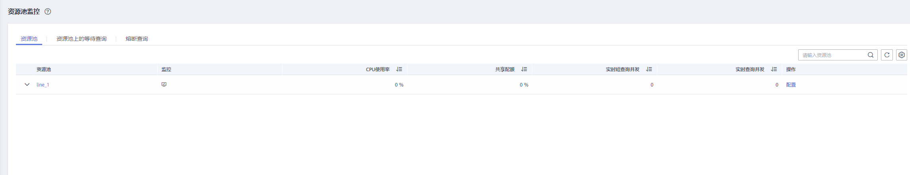
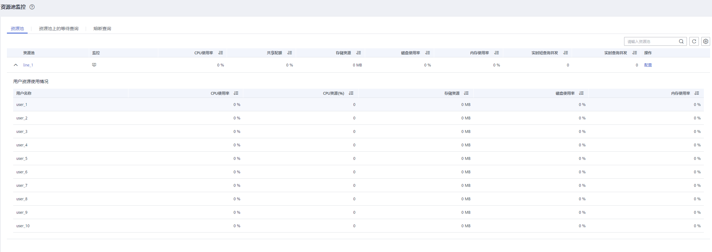
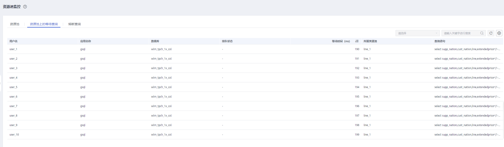
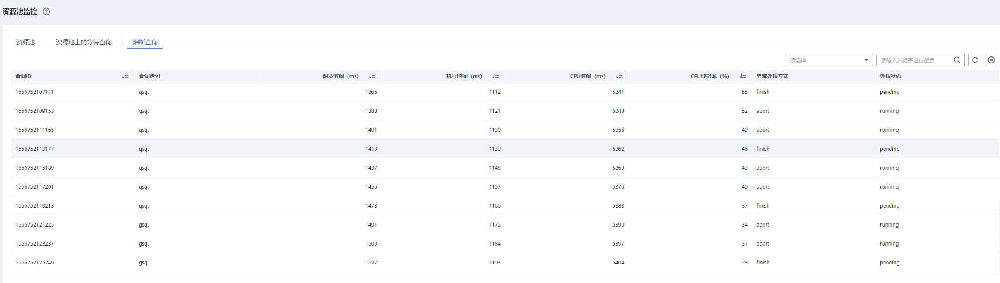

# 资源池监控

## 进入资源池监控页面

1.  登录GaussDB\(DWS\) 管理控制台。
2.  在“集群管理”页面，找到需要查看监控的集群。
3.  在指定集群所在行的“操作”列，单击“监控面板”，系统将显示数据库监控页面。
4.  在左侧导航栏选择“监控\>资源池监控”，进入资源池监控页面。

    在资源池监控页面展示资源池的实时信息和资源池资源消耗的历史信息。

## 资源池

DMS可显示用户定义的资源池名称，实时/历史资源消耗以及资源池资源配额。

-   资源池：资源池名称。
-   监控：单击弹出侧拉栏展示CPU，内存，磁盘等资源池资源的消耗历史趋势。
-   CPU使用率（%）：资源池的实时CPU计算资源使用率。
-   CPU配额（%）：资源池的CPU资源使用率配额。
-   实时短查询并发：资源池的简单查询并发数使用量（判定为简单并发的查询不受资源池的管控）。
-   短查询并发：资源池的简单并发数配额。
-   实时查询并发：资源池的复杂查询并发数使用量（判定为复杂并发的查询受资源池的管控）。
-   查询并发：资源池的复杂并发数配额。
-   存储资源（MB）：资源池的存储空间。
-   磁盘使用率（%）：资源池的实时磁盘使用率。
-   内存资源（%）：资源池的内存配置的百分比。
-   内存使用率（%）：资源池实时内存使用率。
-   操作

## 用户资源使用情况

单击任意资源池的下拉菜单，可以展示该资源池上的用户资源使用情况。

-   用户名称：当前资源池下的用户名称。
-   CPU使用率（%）：用户实时的CPU使用率。
-   CPU资源：用户实时使用CPU的核数。
-   存储资源（MB）：用户实时使用的存储空间。
-   磁盘使用率（%）：用户实时的磁盘使用率。
-   内存资源（MB）：用户实时的内存空间。
-   内存使用率（%）：用户实时的内存使用率。

## 资源池上的等待查询

用户可以实时查看资源池上的等待作业情况，帮助用户识别资源池上的业务压力。

-   用户名：查询语句的用户名称。
-   应用名称：查询语句的应用名称。
-   数据库：查询语句所连接的数据库名称。
-   排队状态：查询语句在资源池中的排队状态。
-   等待时间（ms）：查询语句执行前的等待时间，单位ms。
-   所属资源池： 查询语句所属的资源池。
-   查询语句：用户提交的查询语句的详细内容。

## 熔断查询

用户可以通过熔断查询查看资源池上的熔断规则的触发情况。

-   查询ID：熔断语句的查询ID。
-   查询语句：熔断查询语句。
-   阻塞时间（ms）：熔断语句的阻塞时间，单位ms。
-   执行时间（ms）：熔断语句的执行时间，单位ms。
-   CPU时间（ms）：熔断语句消耗的CPU时间，单位ms。
-   CPU倾斜率（%）：熔断语句在各个DN上的CPU消耗倾斜率。
-   异常处理方式：熔断语句的异常处理方式。
-   处理状态：处理熔断语句的实时状态。

