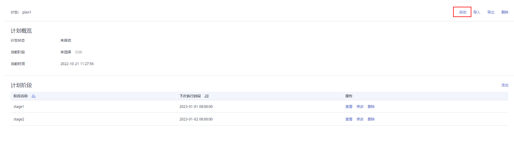
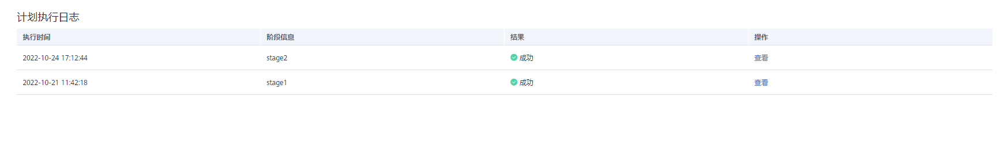
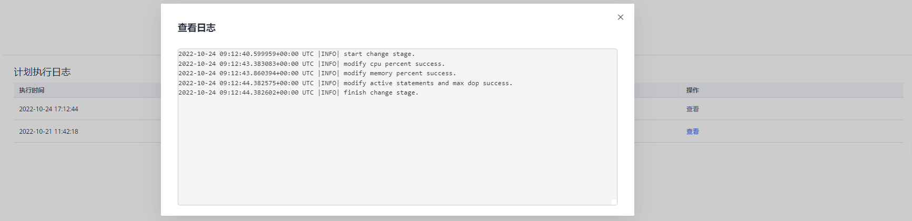
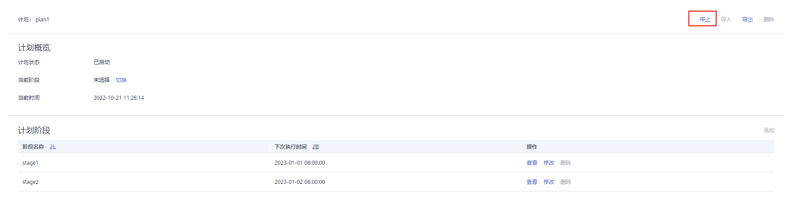
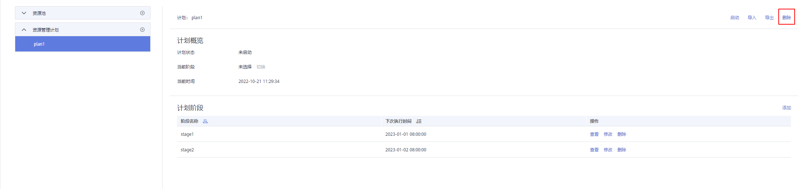

# 资源管理计划操作

## 资源管理计划简介

资源管理计划功能是GaussDB\(DWS\) 为客户提供的资源管理高级特性，客户可以通过创建资源管理计划，向计划中添加多个时间阶段，并为每个阶段配置不同的资源配比。当启动计划时，计划就会按照配置在不同的时间段自动切换资源配置。如果客户在不同的时间段运行不同的业务，而这些业务又会占用不同比重的资源，使用资源管理计划功能可以很好的帮助客户实现不同时间段的资源配置自动切换。

> **说明：** 
>-   资源管理计划支持8.1.0.100及以上版本。

## 添加资源管理计划

1.  登录GaussDB\(DWS\) 管理控制台。
2.  在集群列表中单击需要访问“资源管理”页面的集群名称。
3.  切换至“资源管理”页签。
4.  单击资源管理计划旁的“+”符号添加计划。
5.  填写资源管理计划的计划名称，并点击确认 。

    > **须知：** 
    >1. 创建资源管理计划之前必须提前规划并创建好资源池，请参见[17.2.3-添加资源池](添加资源池.md)。
    >2. 最多支持创建10个资源管理计划。

    

## 启动资源管理计划

1.  登录GaussDB\(DWS\) 管理控制台。
2.  在集群列表中单击需要访问“资源管理”页面的集群名称。
3.  切换至“资源管理”页签。
4.  进入计划详情页面，点击启动按钮启动计划。

    > **须知：** 
    >-   每个集群只能启动一个计划。
    >-   一个计划至少要有两个阶段才能启动。

    

## 查看资源管理计划执行日志

1.  登录GaussDB\(DWS\) 管理控制台。
2.  在集群列表中单击需要访问“资源管理”页面的集群名称。
3.  切换至“资源管理”页签。
4.  进入计划详情页面，在计划执行日志区域查看计划阶段的切换日志。

    

    

## 停止资源管理计划

1.  登录GaussDB\(DWS\) 管理控制台。
2.  在集群列表中单击需要访问“资源管理”页面的集群名称。
3.  切换至“资源管理”页签。
4.  进入计划详情页面，点击停止按钮停止计划。

    

## 删除资源管理计划

1.  登录GaussDB\(DWS\) 管理控制台。
2.  在集群列表中单击需要访问“资源管理”页面的集群名称。
3.  切换至“资源管理”页签。
4.  进入计划详情页面，点击删除按钮删除当前资源管理计划。

    > **须知：** 
    >正在运行的资源管理计划不支持删除。

    

