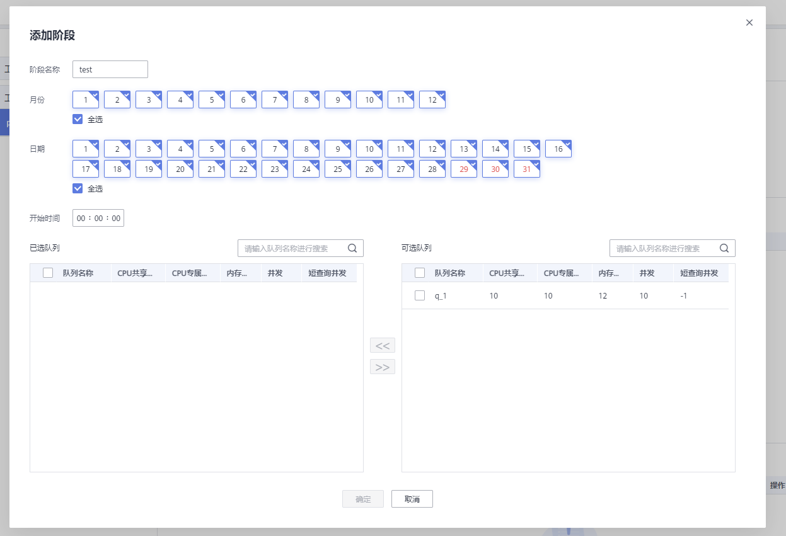
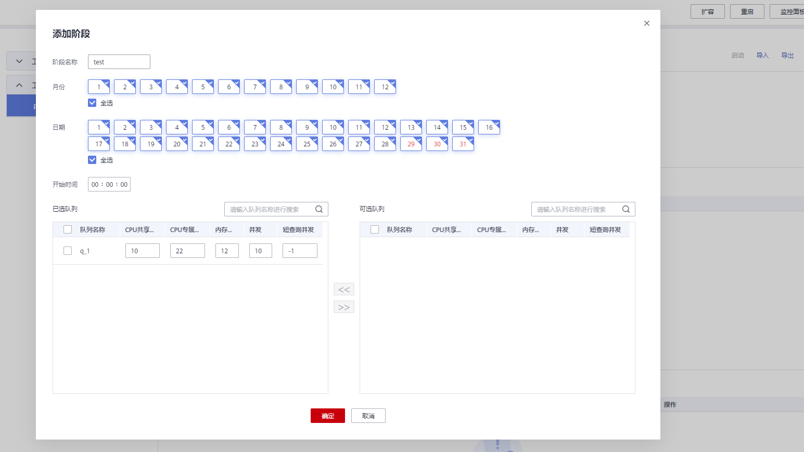
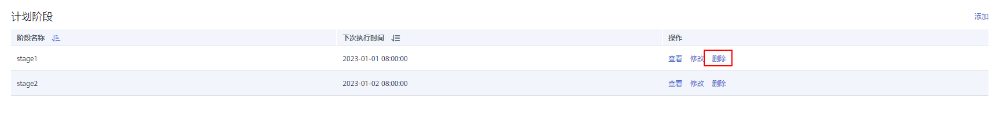

# 资源管理计划阶段

## 前提条件

添加和修改资源管理计划阶段需满足以下条件：

-   所有资源池的CPU共享配额总和不超过99%。
-   所有资源池的CPU专属限额总和不超过100%。

    > **说明：** 
    >-   CPU限额仅8.1.3及以上版本支持。
    >-   开始时间设置默认为UTC时间，具体下次执行时间需根据用户所在时区结合时差转换。

## 添加资源管理计划阶段

1.  登录GaussDB\(DWS\) 管理控制台。
2.  在集群列表中单击需要访问“资源管理”页面的集群名称。
3.  切换至“资源管理”页签。
4.  进入计划详情页面，点击计划阶段区域的“添加”按钮，在添加阶段页面填写阶段名称并配置资源信息，确认成功后点击确定按钮。

    > **须知：** 
    >-   添加阶段时必须停止正在运行的资源管理计划，否则无法添加。
    >-   每个计划最多支持添加48个阶段。
    >-   一个计划中所有阶段的切换时间不能相同。
    >-   时间、日期、月份共同组成执行时间表达式，不允许配置不存在的日期表达式，例如2.30。

    

## 修改资源管理计划阶段

1.  登录GaussDB\(DWS\) 管理控制台。
2.  在集群列表中单击需要访问“资源管理”页面的集群名称。
3.  切换至“资源管理”页签。
4.  进入计划详情页面，点击计划阶段操作列的修改按钮。

    

5.  在修改计划阶段页面可修改阶段的切换时间，资源配置等信息。

    

## 手动切换资源管理计划阶段

运行中的计划如果需要提前切换至某个阶段，可以通过手动切换功能切换至目标阶段。

1.  登录GaussDB\(DWS\) 管理控制台。
2.  在集群列表中单击需要访问“资源管理”页面的集群名称。
3.  切换至“资源管理”页签。
4.  进入计划详情页面，点击计划概览处的切换按钮，选择要切换的目标阶段。

    

## 删除资源管理计划阶段

1.  登录GaussDB\(DWS\) 管理控制台。
2.  在集群列表中单击需要访问“资源管理”页面的集群名称。
3.  切换至“资源管理”页签。
4.  进入计划详情页面，点击计划阶段操作列的删除按钮。

    

> **说明：** 
>删除阶段时必须停止资源管理计划，否则无法删除。

