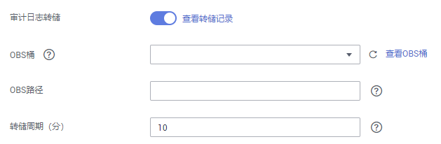

# 转储数据库审计日志

GaussDB\(DWS\) 记录您的数据库中的连接和用户活动相关信息。这些审计日志信息有助于您监控数据库以确保安全或进行故障排除或定位历史操作记录。当前这些审计日志默认存储于数据库中，您还可以将审计日志转储到OBS中使负责监控数据库中活动的用户更方便的查看这些日志信息。

您可以在GaussDB\(DWS\) 管理控制台进行如下操作：

-   [开启审计日志转储](#zh-cn_topic_0000001145696613_section8182105814130)
-   [修改审计日志转储](#zh-cn_topic_0000001145696613_section097518211410)
-   [查看审计日志转储记录](#zh-cn_topic_0000001145696613_section1227433741613)
-   [关闭审计日志转储](#zh-cn_topic_0000001145696613_section156597111415)

> **说明：** 
>-   非OBS场景下，此功能不可用。
>-   调整集群大小、增删CN等变更CN场景会导致数据丢失，建议在执行变更期间关闭审计日志转储。
>-   CN节点故障可能导致丢失该节点数据。

## 开启审计日志转储

GaussDB\(DWS\) 集群创建成功后，您可以为集群开启审计日志转储，将审计日志转储到OBS中，方便查看。

开启审计日志转储前需满足如下条件：

-   已创建用于存储审计日志的OBS桶，具体操作请参见《对象存储服务控制台指南》中的[创建桶](https://support.huaweicloud.com/usermanual-obs/zh-cn_topic_0045829088.html)章节。

开启审计日志转储具体操作如下：

1.  登录GaussDB\(DWS\) 管理控制台。
2.  在左侧导航栏中，单击“集群管理“。
3.  在集群列表中，单击您想要开启审计日志转储的集群的名称，然后在左侧导航栏单击“安全设置“。
4.  在“审计配置“区域中，开启审计日志转储。

    表示开启状态。表示关闭状态。

    每个区域的每个项目首次开启审计日志转储功能时，系统将提示您需创建名称为“DWSAccessOBS”的委托，委托创建成功后，GaussDB\(DWS\) 可以将审计日志转储至OBS中。

    默认情况下，只有华为云帐号或拥有Security Administrator权限的用户才具备查询委托和创建委托的权限。帐号中的IAM用户，默认没有查询委托和创建委托的权限，此时需联系有权限的用户在当前页面完成对GaussDB\(DWS\) 的委托授权。

    **图 1**  开启审计日志转储  
    

    -   OBS桶：存储审计数据的OBS桶名称。如果没有可选择的OBS桶，可以单击“查看OBS桶“进入OBS管理控制台创建新的OBS桶，具体操作请参见《对象存储服务控制台指南》中的[创建桶](https://support.huaweicloud.com/usermanual-obs/zh-cn_topic_0045829088.html)章节。
    -   OBS路径：在OBS中存储审计文件的自定义目录。多级目录可用“/”进行分隔，不能以“/”开头。路径取值范围：1\~50个字符。如果填写的OBS路径不存在时，系统会先创建该OBS路径再进行转储。
    -   转储周期（分）：根据用户配置的时间，周期性的将数据转储到OBS中。取值范围：5～28800。单位为分钟。

5.  单击“应用“。

    “配置状态“显示为“应用中“，表示系统正在保存配置。

    等待一段时间后再次刷新“配置状态“，当显示为“已同步“，表示已保存配置并生效。

## 修改审计日志转储

开启审计日志转储后，您可以对转储配置进行修改，如修改日志存放的OBS桶和路径，转储周期等。

修改审计日志转储具体操作如下：

1.  登录GaussDB\(DWS\) 管理控制台。
2.  在左侧导航栏中，单击“集群管理“。
3.  在集群列表中，单击您想要修改审计日志转储的集群的名称，然后在左侧导航栏单击“安全设置“。
4.  在“审计配置“区域中，修改审计日志转储配置。
5.  单击“应用“。

    “配置状态“显示为“应用中“，表示系统正在保存配置。

    等待一段时间后再次刷新“配置状态“，当显示为“已同步“，表示已保存配置并生效。

## 查看审计日志转储记录

开启审计日志转储后，您可以通过OBS查看转储的审计日志。

查看审计日志转储记录具体操作如下：

1.  登录GaussDB\(DWS\) 管理控制台。
2.  在左侧导航栏中，单击“集群管理“。
3.  在集群列表中，单击您想要查看审计日志转储记录的集群的名称，然后在左侧导航栏单击“安全设置“。
4.  在“审计配置“区域中，单击“查看转储记录“。
5.  在弹出的“审计日记转储记录“弹出框中，单击“查看OBS桶“，进入OBS管理控制台。
6.  选择日志存放的OBS桶和文件夹进入查看具体的日志文件。

    您可以选择将日志文件下载，解压并打开查看。审计日志文件字段说明如下。

    **表 1**  审计日志文件字段说明

    
    <table><thead align="left"><tr id="zh-cn_topic_0000001145696613_row1120133942518"><th class="cellrowborder" valign="top" width="33.58%" id="mcps1.2.3.1.1">
<strong id="zh-cn_topic_0000001145696613_b2020113982517">名称</strong>

    </th>
    <th class="cellrowborder" valign="top" width="66.42%" id="mcps1.2.3.1.2">
<strong id="zh-cn_topic_0000001145696613_b22011239162514">描述</strong>

    </th>
    </tr>
    </thead>
    <tbody><tr id="zh-cn_topic_0000001145696613_row1201143913255"><td class="cellrowborder" valign="top" width="33.58%" headers="mcps1.2.3.1.1 ">
time

    </td>
    <td class="cellrowborder" valign="top" width="66.42%" headers="mcps1.2.3.1.2 ">
操作时间

    </td>
    </tr>
    <tr id="zh-cn_topic_0000001145696613_row220193916257"><td class="cellrowborder" valign="top" width="33.58%" headers="mcps1.2.3.1.1 ">
type

    </td>
    <td class="cellrowborder" valign="top" width="66.42%" headers="mcps1.2.3.1.2 ">
操作类型

    </td>
    </tr>
    <tr id="zh-cn_topic_0000001145696613_row14202193913256"><td class="cellrowborder" valign="top" width="33.58%" headers="mcps1.2.3.1.1 ">
result

    </td>
    <td class="cellrowborder" valign="top" width="66.42%" headers="mcps1.2.3.1.2 ">
操作结果

    </td>
    </tr>
    <tr id="zh-cn_topic_0000001145696613_row82021839152512"><td class="cellrowborder" valign="top" width="33.58%" headers="mcps1.2.3.1.1 ">
username

    </td>
    <td class="cellrowborder" valign="top" width="66.42%" headers="mcps1.2.3.1.2 ">
执行操作的用户名

    </td>
    </tr>
    <tr id="zh-cn_topic_0000001145696613_row7202163932520"><td class="cellrowborder" valign="top" width="33.58%" headers="mcps1.2.3.1.1 ">
database

    </td>
    <td class="cellrowborder" valign="top" width="66.42%" headers="mcps1.2.3.1.2 ">
数据库名称

    </td>
    </tr>
    <tr id="zh-cn_topic_0000001145696613_row4202153919253"><td class="cellrowborder" valign="top" width="33.58%" headers="mcps1.2.3.1.1 ">
client_conninfo

    </td>
    <td class="cellrowborder" valign="top" width="66.42%" headers="mcps1.2.3.1.2 ">
客户端连接信息

    </td>
    </tr>
    <tr id="zh-cn_topic_0000001145696613_row720343918255"><td class="cellrowborder" valign="top" width="33.58%" headers="mcps1.2.3.1.1 ">
object_name

    </td>
    <td class="cellrowborder" valign="top" width="66.42%" headers="mcps1.2.3.1.2 ">
操作对象名称

    </td>
    </tr>
    <tr id="zh-cn_topic_0000001145696613_row1820353932515"><td class="cellrowborder" valign="top" width="33.58%" headers="mcps1.2.3.1.1 ">
detail_info

    </td>
    <td class="cellrowborder" valign="top" width="66.42%" headers="mcps1.2.3.1.2 ">
执行操作详细信息

    </td>
    </tr>
    <tr id="zh-cn_topic_0000001145696613_row82038394256"><td class="cellrowborder" valign="top" width="33.58%" headers="mcps1.2.3.1.1 ">
node_name

    </td>
    <td class="cellrowborder" valign="top" width="66.42%" headers="mcps1.2.3.1.2 ">
节点名称

    </td>
    </tr>
    <tr id="zh-cn_topic_0000001145696613_row22031539152519"><td class="cellrowborder" valign="top" width="33.58%" headers="mcps1.2.3.1.1 ">
thread_id

    </td>
    <td class="cellrowborder" valign="top" width="66.42%" headers="mcps1.2.3.1.2 ">
线程ID

    </td>
    </tr>
    <tr id="zh-cn_topic_0000001145696613_row1820483932510"><td class="cellrowborder" valign="top" width="33.58%" headers="mcps1.2.3.1.1 ">
local_port

    </td>
    <td class="cellrowborder" valign="top" width="66.42%" headers="mcps1.2.3.1.2 ">
本地端口号

    </td>
    </tr>
    <tr id="zh-cn_topic_0000001145696613_row172041339182514"><td class="cellrowborder" valign="top" width="33.58%" headers="mcps1.2.3.1.1 ">
remote_port

    </td>
    <td class="cellrowborder" valign="top" width="66.42%" headers="mcps1.2.3.1.2 ">
远端端口号

    </td>
    </tr>
    </tbody>
    </table>

## 关闭审计日志转储

审计日志转储开启后，如果您不想将审计日志转储到OBS中，您可以将审计日志转储关闭。

关闭审计日志转储具体操作如下：

1.  登录GaussDB\(DWS\) 管理控制台。
2.  在左侧导航栏中，单击“集群管理“。
3.  在集群列表中，单击您想要关闭审计日志转储的集群的名称，然后在左侧导航栏单击“安全设置“。
4.  在“审计配置“区域中，关闭审计日志转储开关。

    表示关闭状态。

5.  单击“应用“。

    “配置状态“显示为“应用中“，表示系统正在保存配置。

    等待一段时间后再次刷新“配置状态“，当显示为“已同步“，表示已保存配置并生效。

