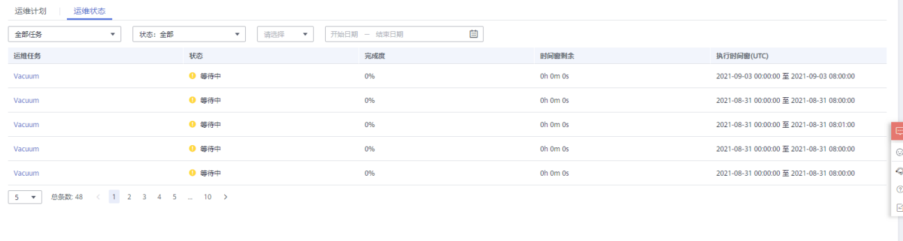
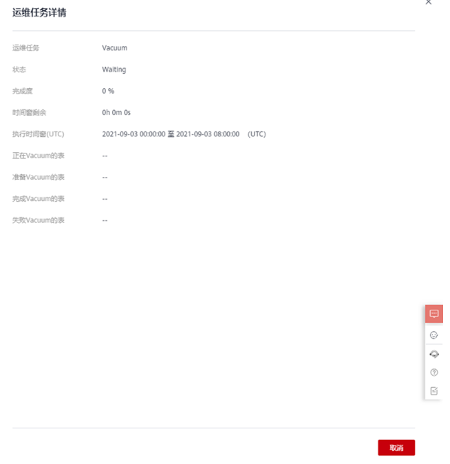

# 运维状态

1.  登录GaussDB\(DWS\) 管理控制台。
2.  在集群列表中单击指定集群名称。
3.  进入“集群详情”页面，切换至“智能运维”页签。
4.  在运维详情部分切换至运维状态模块。

    

5.  单击指定运维任务名称，将显示运维任务运行的详细信息。

    -   运维任务：Vacuum
    -   状态：
        -   Waiting
        -   Running
        -   Finished
        -   Canceled

    -   完成度
    -   时间窗剩余
    -   执行时间窗（UTC）
    -   正在Vacuum的表
    -   准备Vacuum的表
    -   完成Vacuum的表
    -   失败Vacuum的表

    

    > **说明：** 
    >其中正在Vacuum的表，准备Vacuum的表，已完成Vacuum的表和Vacuum失败的表最多显示100张。

