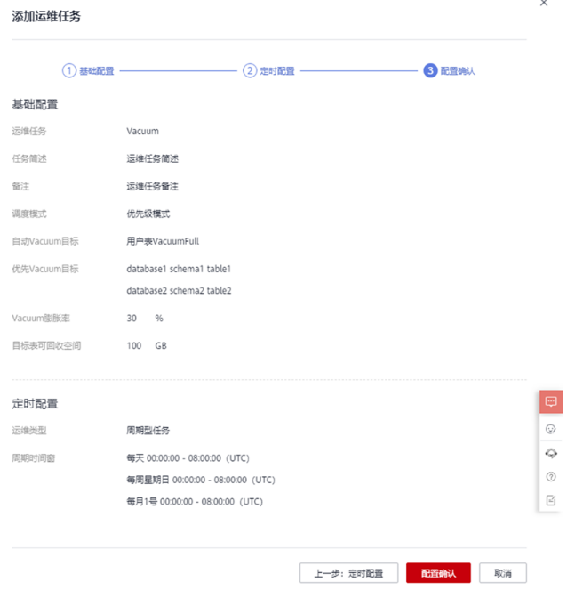

# 运维计划

## 运维任务公共配置

1.  登录GaussDB\(DWS\) 管理控制台。
2.  在集群列表中单击指定集群名称。
3.  进入“集群详情”页面，切换至“智能运维”页签。
4.  页面上方“运维任务公共配置”，填写“用户表VacuumFull运维任务最大并发数”配置值，单击右上角“保存”完成配置。

    

    > **说明：** 
    >-   该配置应用于每个用户表VacuumFull运维任务中。
    >-   最大并发数配置范围为1\~24，用户可根据剩余磁盘空间和IO负载，合理设置最大并发数，建议设置为5。

## 添加运维计划

1.  登录GaussDB\(DWS\) 管理控制台。
2.  在集群列表中单击指定集群名称。
3.  进入“集群详情”页面，切换至“智能运维”页签。
4.  在运维详情部分切换至运维计划模块。单击“添加运维任务”按钮。

    

5.  弹出添加运维任务边栏，配置运维任务模式。
    -   运维任务：Vacuum（目前仅支持Vacuum运维任务）。
    -   任务简介：该运维任务可帮助用户定期调用系统Vacuum命令，以实现空间回收。
    -   备注
    -   调度模式：
        -   自动：智能运维将在指定时间窗内扫描数据库，依据用户业务负载、用户表可回收空间，自动下发表级Vacuum任务。

            

        -   指定目标：用户需配置优先Vacuum目标，智能运维将在指定时间窗内，自动下发表级Vacuum任务。

            

        -   优先级模式：用户可配置优先Vacuum目标，若时间窗剩余，智能运维将自动扫描其他可Vacuum的表，并下发表级Vacuum任务。

            

            > **注意：** 
            >建议使用指定目标方式进行Vacuum和VacuumFull，同时不建议对列存宽表进行VacuumFull，以防止内存膨胀。

    -   自动Vacuum目标：包含两种模式，系统表Vacuum和用户表VacuumFull。
        -   对于系统表Vacuum，会持有系统表五级锁（share update exclusive锁），不会阻塞用户业务，仅会阻塞系统表DDL进程。
        -   对于用户表Vacuum Full，会持有系统表的八级锁（access exclusive锁），期间所有访问会被阻塞，并等待Vacuum Full结束，建议用户合理安排调度时间，在业务负载低峰期执行Vacuum Full操作，避免锁表影响业务。

            > **说明：** 
            >Vacuum Full操作相当于开辟一块和表数据大小相同的空间（表真实数据大小约为表总大小\* \(1 – 脏页率\)），因此表空间会先增后降，请提前计算好Vacuum Full所需要的空间再行处理。

    -   优先Vacuum目标：用户可配置优先Vacuum目标，其中一行对应一张表，每张表以数据库名、模式名、表名表示，以空格进行分割。
    -   高级配置：选择“自定义”时，您可以根据实际需求设置自动Vacuum触发条件，即Vacuum膨胀率和目标表可回收空间。

        若选择“默认配置”，Vacuum膨胀率默认为30%，目标表可回收空间默认为100GB。

6.  单击“下一步：定时配置”，选择定时运维类型。

    -   单次型任务：需要设置起止时间，智能运维将在设置的时间段内运行运维任务。

        

    -   周期型任务：需要配置时间窗，时间窗配置提供每日、每周、每月三种类型供用户选择。智能运维将自动分析用户注册的时间段，在每个时间段内运行运维任务。

        

    > **注意：** 
    >-   对于自动Vacuum运维任务，用户配置时间窗时，应避开业务高峰期。否则自动Vacuum将有可能与用户业务产生死锁冲突。
    >-   vacuum\(full\)运维任务对于用户表并发度最高为24，最低为0；对于系统表并发度最高为1，最低为0。并发度不支持用户自定义，但可根据系统io\_util自动调节：
    >    -   io\_util将0%\~60%划分为两个区间段：
    >        -   0%\~30%区间段，io\_util每减少15%，并发度增加2。
    >        -   30%\~60%区间，io\_util值每减少15%，并发度增加1。
    >    -   60%\~70%并发度不变。
    >    -   70%以上并发度减1，如果仍维持70%以上IO，则并发度持续减到0。
    >-   调度器会在时间窗内，扫描列存小CU膨胀情况，若发现列存CU膨胀（列存CU的膨胀依据是CU平均记录数小于1000），则调度器会将该列存表优先级提前。列存CU膨胀检测条件不受膨胀率、可回收空间限制。
    >-   优先级表最多支持添加100个任务表。
    >-   调度器自动vacuum功能依赖于统计信息，若统计信息不准确，可能会影响调度器自动vacuum执行顺序以及统计结果。
    >-   调度器不支持带有空格和单引号的表，包括数据库名，schema名，表名。如果vacuum在扫描过程中遇到带有单引号或空格的表，将自动跳过。对于优先级表中有空格或单引号的表，也自动跳过。

7.  单击“下一步：配置确认”，确认无误后单击“配置确认”提交。

    

## 修改运维计划

1.  登录GaussDB\(DWS\) 管理控制台。
2.  在集群列表中单击指定集群名称。
3.  进入“集群详情”页面，切换至“智能运维”页签。
4.  在运维详情部分切换至运维计划模块，在指定运维任务所在行操作列单击“修改”按钮。

    

5.  弹出修改运维任务边栏，修改运维任务功能与添加运维任务功能保持一致，详情请参见[添加运维计划](#section12256103112263)。

    

6.  确认修改后单击“确定”提交。

## 查看运维任务详情

1.  登录GaussDB\(DWS\) 管理控制台。
2.  在集群列表中单击指定集群名称。
3.  进入“集群详情”页面，切换至“智能运维”页签。
4.  在运维详情部分切换至运维计划模块，在指定运维任务所在行操作列单击“详情”按钮。

    

5.  弹出运维任务详情边栏，用户可查看确认。

    

