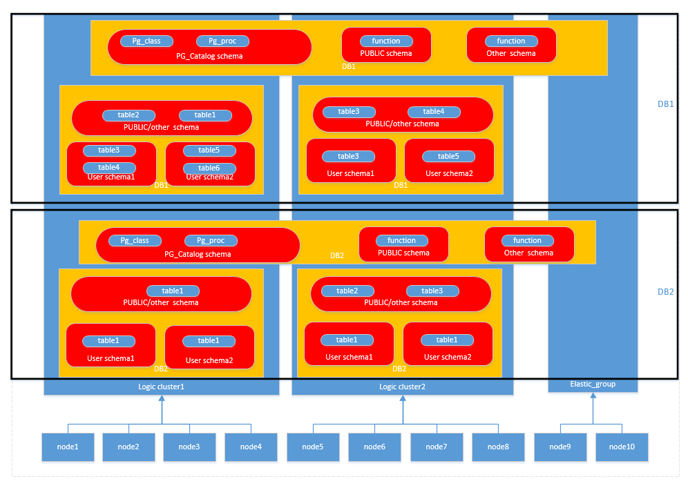

# 逻辑集群概述

逻辑集群是基于Node Group机制来划分物理节点的一种集群模式，从节点层次将大集群进行划分，和数据库形成交叉。一个数据库中的表可以按逻辑集群来分配到不同的物理节点，而一个逻辑集群也可以包含多个数据库的表。在划分逻辑集群后，整个数据库中对象间的层次关系如[图1](#fig1216495717015)所示。

**图 1**  逻辑集群、数据库、表层次关系  

> **说明：** 
>-   逻辑集群支持8.1.0.100及以上版本。
>-   在实际业务场景中，建议用户尽可能将同一个数据库的表创建到同一个逻辑集群中。
>-   逻辑集群不支持调整大小。

## 权限说明（在逻辑集群模式下）

-   逻辑集群创建权限（CREATE ON NODE GROUP）允许授予任何用户/角色，创建权限后可在对应的逻辑集群上进行创建表等相关操作。
    -   如果创建的表指定的schema是某个用户私有schema（即该schema和用户同名且schema的owner是该用户），则新创建的表会将owner自动变更为该用户，不需要进行关联逻辑集群操作。
    -   如果用户关联了逻辑集群，则表创建在所关联的逻辑集群上；否则，根据逻辑集群的[建表规则](#li591882483418)创建。
    -   和逻辑集群关联的用户在创建表时不需要指定to group，支持变更用户关联的逻辑集群。

-   建表规则
    -   用户表在没有指定to group时，如果设置了default\_storage\_nodegroup参数，则会将表创建到指定的逻辑集群中。
    -   如果default\_storage\_nodegroup参数设置为installation时，则会将表创建到第一个逻辑集群中（即所有逻辑集群中oid最小的一个）。

-   允许修改表的owner为任何用户，但对表进行操作时，需要检查对应的schema和nodegroup权限。
-   系统管理员可以关联到特定逻辑集群，并在多个逻辑集群中创建表。
    -   系统管理员如果关联了逻辑集群，那么创建表时如果未指定to group，那么会默认创建到关联的逻辑集群中；如果指定了to group，则可将表创建到指定的逻辑集群中。
    -   系统管理员如果没有关联逻辑集群，没有指定to group，则创建在由default\_storage\_nodegroup参数指定的逻辑集群中，详情参见[建表规则](#li591882483418)。

-   允许将系统管理员权限授予关联了逻辑集群的用户，但同样遵循建表规则。
-   非表对象（schema/sequence/function/trigger等）的访问不再检查逻辑集群权限。
-   系统中的资源池必须关联到特定逻辑集群。
    -   在一个逻辑集群下可以创建多个资源池，同一个资源池不能属于多个逻辑集群。
    -   由于资源池定义了资源使用量，因此关联特定资源池的逻辑集群用户发起的作业将受到该资源池的资源约束。
    -   逻辑集群下不需要创建负载组来定义并发作业的数量。因此，逻辑集群模式不再支持负载组。

-   逻辑集群删除时只删除表、外表，资源池对象，其他对象不会删除。
    -   如果有对象依赖逻辑集群下的表（部分依赖表的sequence/function/triggers）同样也会删除。
    -   逻辑集群删除过程会取消用户关联关系，删除已有的父子租户关系，该集群用户将会绑定默认的installation nodegroup，关联全局默认资源池。

-   逻辑集群用户如果有创建数据库权限也可创建数据库。

## 弹性集群

弹性集群是指在逻辑集群模式下，非逻辑集群节点组成的集群并且总是存在。弹性集群的名称为elastic\_group，是一个特殊的Node Group，可以包含多个或不包含任何DN节点。

弹性集群不能用户手动创建，在物理集群下第一次创建逻辑集群时自动创建弹性集群，物理集群中所有不属于逻辑集群的物理节点都会加入弹性集群。后续逻辑集群创建所需的DN节点都是来自弹性集群中。因此，为了能够创建新的逻辑集群，需要保证弹性集群中有DN节点存在（在物理集群模式下第一次创建逻辑集群时不需要）。用户可以通过扩容向弹性集群添加新的物理节点。

## 复制表节点组

复制表节点组是逻辑集群模式下一种特殊的节点组，它可以包含一个或多个逻辑集群，但只能创建复制表。典型应用场景是用来创建公共维度表。如果多个逻辑集群都需要一些相同的公共维表，可以创建复制表节点组，并将这些公共维表创建在这个节点组中。复制表节点组包含的逻辑集群都可在本DN上直接访问这些维度表，而不需访问其他DN节点上的表。如果复制表节点组包含的逻辑集群中有任何一个发生了扩容或缩容操作，复制表节点组也会随之扩容或缩容。如果包含的逻辑集群被删除了，复制表节点组会随之缩容。但如果复制表节点组只包含一个逻辑集群，这种情况下如果逻辑集群被删除，则复制表节点组也会删除。通常情况下用户不应该创建这样的复制表节点组，而是应该将表创建到逻辑集群内。

复制表节点组通过SQL语句CREATE NODE GROUP创建，通过DROP NODE GROUP语句删除，删除前需要将该节点组上的表对象都删。

> **说明：** 
>8.1.2及以上版本支持创建复制表节点组。

## 约束和限制

-   逻辑集群的创建、扩容和缩容必须以环为单位，最少3个物理节点，DN的主备从必须在同一环所包含的物理节点内。
-   逻辑集群不支持单独备份和恢复。
-   逻辑集群不支持单独升级。
-   逻辑集群可以重启，但不支持单独的停止和启动。
-   物理集群转换为逻辑集群模式之后不支持回退到物理集群。
-   逻辑集群支持资源管理功能仅8.1.3.101及以上版本支持。

