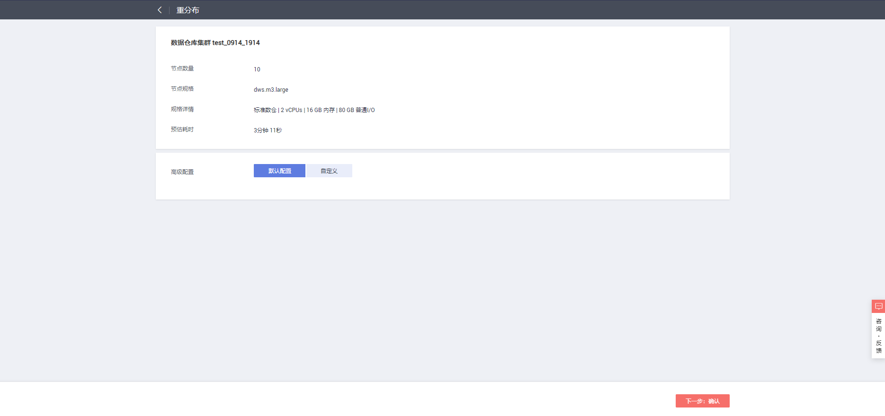
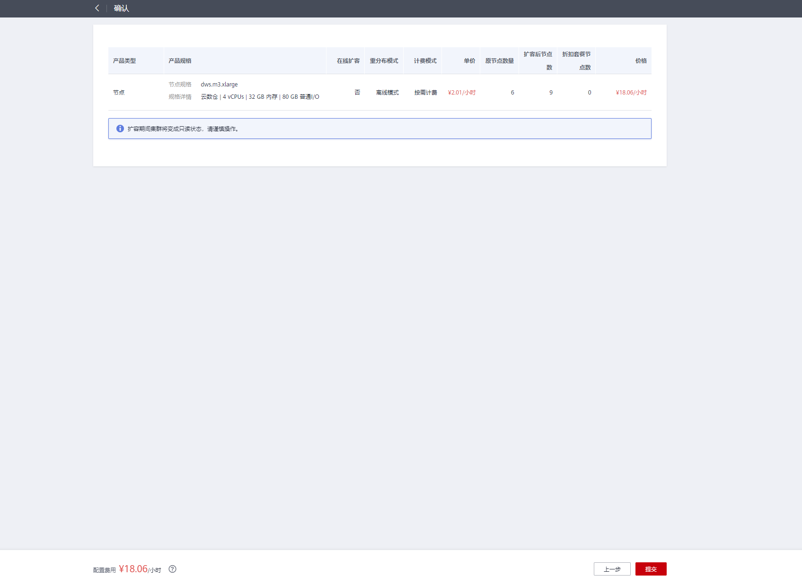
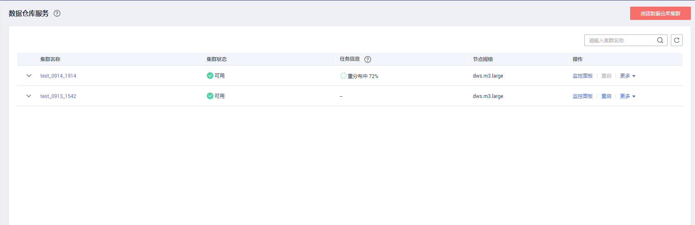
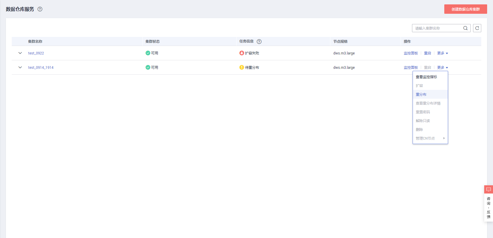
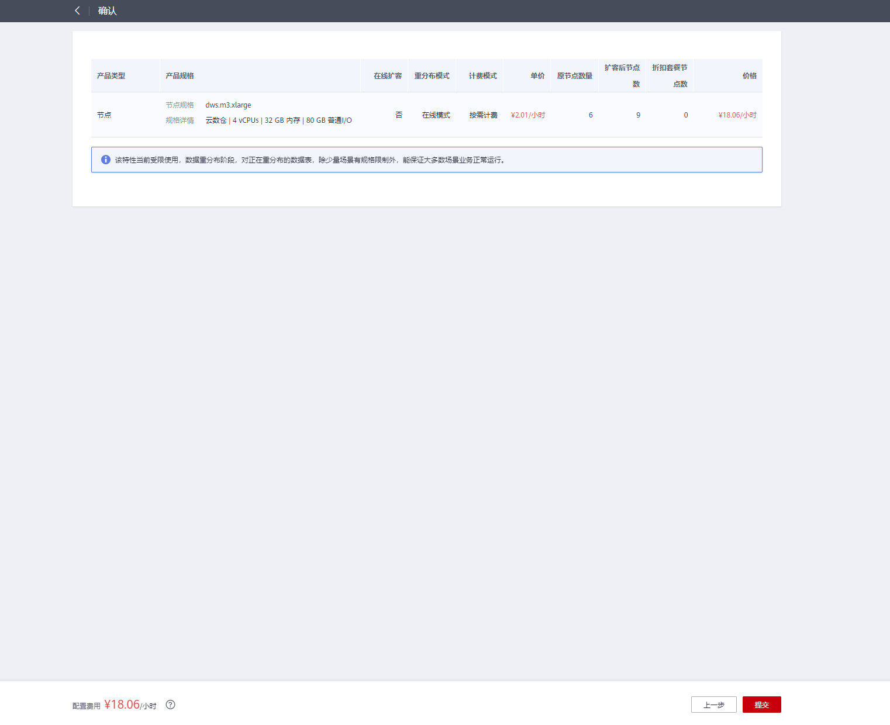
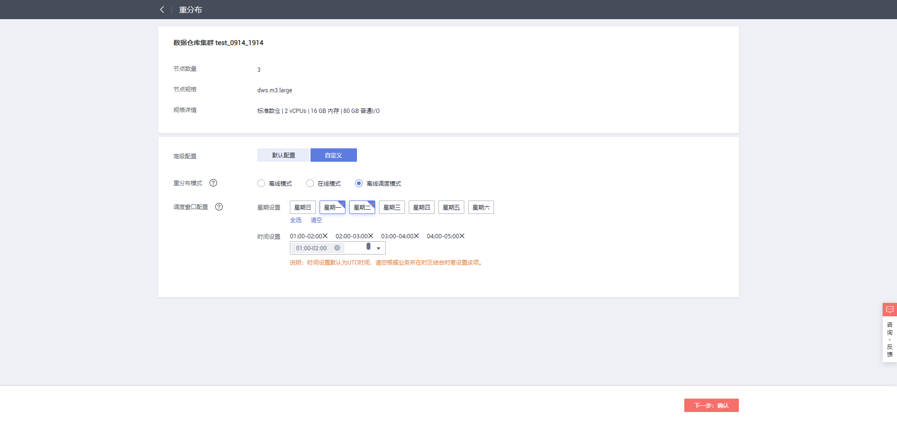
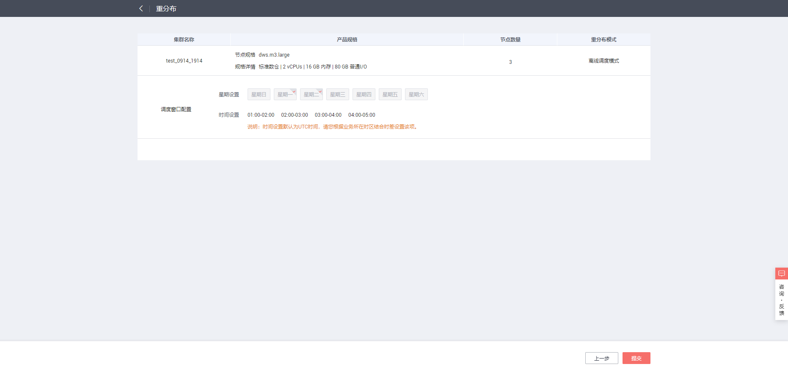

# 重分布

集群重分布是集群扩容后的一项重要且耗时的任务，集群扩容前，业务数据都集中分布在老节点上，扩容之后新增空的可用节点，此时将老节点的数据均匀分布到新扩节点的过程称为数据“重分布”，数据“重分布”后将大大提升业务响应速率。

默认情况下，在扩容之后将自动调起重分布任务，为了增强扩容重分布整个流程的可靠性，可以选择在扩容时关闭自动重分布功能，在扩容成功之后再手动使用重分布功能执行重分布任务，在这种分段模式下，扩容和重分布都可以做到失败重试。

当前重分布支持[离线重分布](#section858715017148)、[在线重分布](#section2706112181411)两种模式，默认情况下，提交重分布任务时将选择离线重分布模式。

> **须知：** 
>-   重分布功能8.1.1.200及以上版本支持。
>-   离线调度重分布模式在8.2.0及以上版本将不再支持。
>-   只有在扩容之后，集群任务信息为“待重分布”状态时才能手动使用“重分布”功能，其他时段该功能不可使用。
>-   在扩容阶段也可以选择重分布模式等高级配置，详情参见[设置高级配置](扩容集群.md#li1283703664815)。
>-   IoT数仓暂不支持重分布。

## 离线重分布

**注意事项**

-   离线重分布模式下数据库不支持DDL和DCL操作，正在重分布的表只支持简单的DQL操作。
-   表重分布期间会对表加共享锁，所有插入、更新、删除操作和表DDL操作都会长时间阻塞，会出现等锁超时情况。在重分布执行过程中，用户应当避免执行超过20分钟的查询（在重分布执行时申请写锁的默认时间为20分钟）。否则可能导致重分布出现等待加锁超时失败的问题。

**操作步骤**

1.  登录GaussDB\(DWS\) 管理控制台。
2.  单击“集群管理“。默认显示用户所有的集群列表。
3.  集群列表中，在指定集群所在行的“操作“列，选择“更多  \>  重分布“。

    系统将显示“重分布”页面。

    

4.  在“重分布”页面选择默认的离线模式，单击“下一步：确认”提交重分布任务。

    

    

    

## 在线重分布

**注意事项**

在线重分布模式下数据库支持部分DDL和DCL操作。

-   正在重分布的表支持插入、删除、更新和部分DDL语法。支持功能如下：
    -   重分布过程中用户可进行正在重分布的本地表的INSERT、DELETE、UPDATE、MERGE INTO、OVERWRITE、UPSERT业务。
    -   重分布过程中用户可进行正在重分布的本地表跨节点组的关联查询业务。
    -   重分布过程中用户可进行正在重分布的本地表的重命名、修改schema、DROP、TRUNCATE、TRUNCATE-PARTITION业务。

-   正在重分布的表不支持功能如下：
    -   正在重分布过程中用户不能执行ALTER TABLE语句，典型包括增加、删除字段，增加或删除分区等，但TRUNCATE PARTITION除外。
    -   表正在重分布过程中用户不能创建、修改、删除索引。
    -   表正在重分布过程中用户不能对该表执行vacuum full和cluster语句。
    -   表正在重分布过程中用户不能修改字段依赖的SEQUENCE对象，包括创建和修改字段依赖的SEQUENCE对象，典型的语句是CREATE/ALTER SEQUENCE ... OWNED BY。
    -   超过996列的表，表重分布期间不支持UPDATE和DELETE语句，更新删除语句会报错，但允许执行SELECT/INSERT语句。
    -   整个重分布过程中不支持创建、删除或修改Database对象和Tablespace对象。
    -   重分布过程是以表为单位执行，如果用户执行交换分区，分区表和待交换的非分区表有一个完成重分布，一个没有完成重分布，这两个表属于两个节点组，这种情况不支持交换分区，需要等两个表都重分布完之后才能执行交换分区。

**操作步骤**

1.  登录GaussDB\(DWS\) 管理控制台。
2.  单击“集群管理“。默认显示用户所有的集群列表。
3.  集群列表中，在指定集群所在行的“操作“列，选择“更多  \>  重分布“。

    

4.  在“重分布”页面的“高级配置”单击“自定义”并选择“在线模式”，单击“下一步：确认”提交重分布任务。

    

    

## 离线调度重分布

**注意事项**

离线调度模式与离线重分布模式相似，只不过调度模式只会在配置的时间窗口内做表的重分布，时间窗口外将处于重分布暂停状态。

> **须知：** 
>-   调度重分布模式仅8.1.3及以上版本支持。
>-   调度重分布过程中如果集群故障，页面将会显示“重分布失败”，待集群故障恢复后，重分布会自动执行，重分布完成后需要在页面重新点击“重分布”按钮消除“重分布失败”状态。

**操作步骤**

1.  登录GaussDB\(DWS\) 管理控制台。
2.  单击“集群管理“。默认显示用户所有的集群列表。
3.  集群列表中，在指定集群所在行的“操作“列，选择“更多  \>  重分布“。

    系统将显示“重分布”页面。

    

4.  在“重分布”页面的“高级配置”单击“自定义”并选择“离线调度模式”，并配置好离线时间窗，单击“下一步：确认”提交重分布任务。

    

    

    

> **说明：** 
>调度重分布模式在提交重分布任务后，在配置的执行时间段列表之外的时间，重分布将处于暂停状态，集群信息将显示“重分布暂停”。

