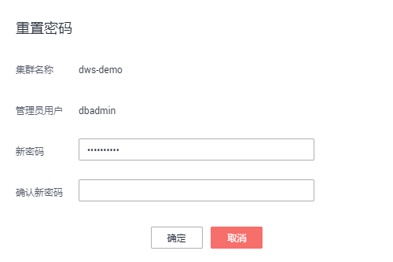

# 重置密码

GaussDB\(DWS\) 支持对管理员帐号进行重置密码。当管理员忘记密码或者在登录时连续输错密码的次数达到上限导致帐号被锁时，可以在“集群管理“页面重置密码，重置密码后帐号即可自动解锁。输错密码的次数上限默认为10次，可以在集群的“参数修改”页面通过参数[failed\_login\_attempts](管理参数模板.md#section926416313488)进行设置，设置方法请参见[修改数据库参数](修改数据库参数.md)。

## 重置密码

1.  登录GaussDB\(DWS\) 管理控制台。
2.  单击“集群管理“。
3.  在指定集群的“操作“列，选择“更多  \>  重置密码“，弹出“重置密码“页面。

    **图 1**  重置密码  
    

4.  填写并确认新密码，单击“确定“。

    密码复杂度要求如下：

    -   密码长度为8～32个字符。
    -   不能与用户名或倒序的用户名相同。
    -   密码至少包含大写字母、小写字母、数字和特殊字符四类中的三类，其中可输入的特殊字符为：\(\~!\`?,.:;-\_'"\(\)\{\}\[\]/<\>@\#%^&\*+|\\=\)。
    -   弱口令检查。

    -   新密码不能与当前密码或当前密码的倒序相同。
    -   不能将历史密码重复使用。

    > **说明：** 
    >若集群默认管理员用户被删除或者重命名，将导致重置密码操作失败。

