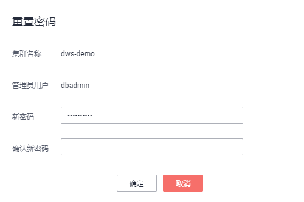

# 重置集群管理员密码

## 操作场景

用户需要重置集群管理员密码时，例如当管理员忘记密码或者登录时连续输错10次密码导致帐号被锁，可以在“集群管理“页面重置密码。

## 操作步骤

1.  通过访问以下地址登录DWS管理控制台：[https://console.huaweicloud.com/dws](https://console.huaweicloud.com/dws)。
2.  单击“集群管理“。
3.  在指定集群的“操作“列，单击“更多  \>  重置密码“，弹出“重置密码“页面。

    **图 1**  重置密码  
    

4.  填写并确认新密码，单击“确定“。

    密码复杂度要求如下：

    -   密码长度为8～32个字符。
    -   不能与用户名或倒序的用户名相同。
    -   密码至少包含大写字母、小写字母、数字和特殊字符四类中的三类，其中可输入的特殊字符为：\~!@\#%^&\*\(\)-\_=+|\[\{\}\];:,<.\>/?
    -   弱口令检查。

    -   新密码不能与当前密码或当前密码的倒序相同。
    -   不能将历史密码重复使用。

    > **说明：**   
    >若集群默认管理员用户被删除或者重命名，将导致重置密码操作失败。  

