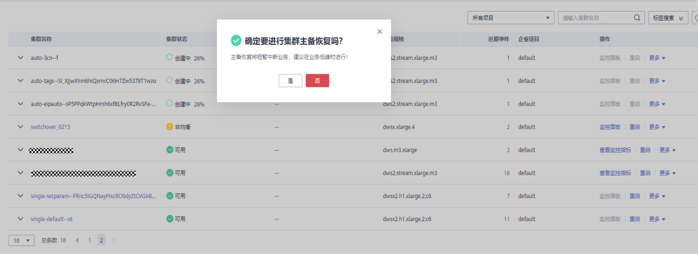

# 集群主备恢复

## 背景说明

当集群状态为“非均衡”时会出现某些节点主实例增多，从而负载压力较大。这种情况下集群状态是正常的，但整体性能要低于均衡状态。可参考本章节进行集群主备恢复操作将集群状态切换为“可用“状态。

> **说明：** 
>-   集群主备恢复仅8.1.1.202及以上版本支持。
>-   集群主备恢复将会短暂中断业务，中断时间根据用户自身业务量所决定，建议用户在业务低峰期执行此操作。

## 操作步骤

1.  登录GaussDB\(DWS\) 管理控制台。
2.  在“集群管理“页面，找到非均衡状态的集群。
3.  在指定集群所在行“集群状态”列，在“非均衡”状态下单击“一键修复“。

    

4.  在弹出对话框中，确认业务处于低峰期，然后再进行主备恢复确认，确认无误后单击“是”后页面右上角显示主备恢复请求下发成功。

    

5.  此时集群进行主备恢复操作，集群的任务信息变为“主备恢复中”，当集群主备恢复成功后，集群状态变为“可用”。

    

