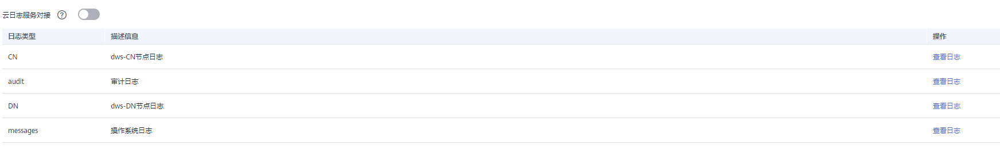
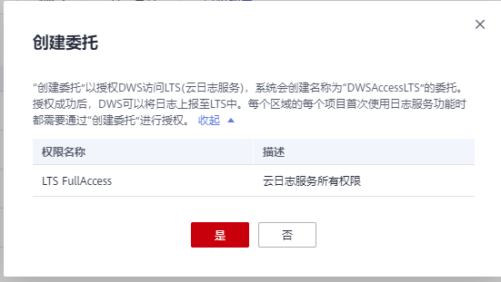
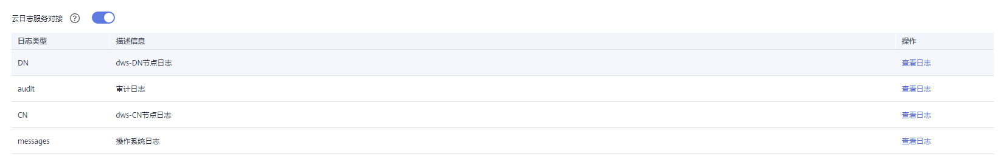
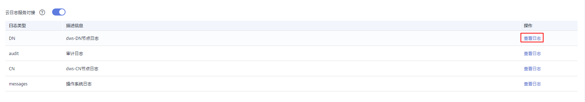
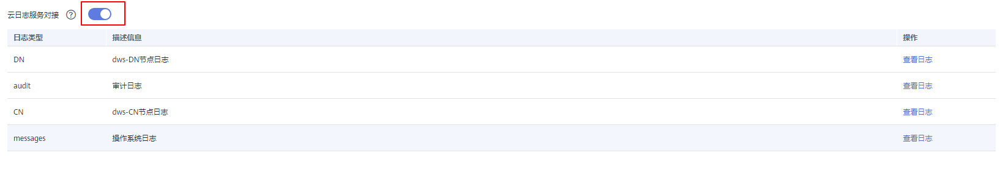
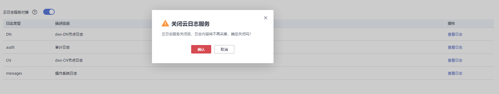

# 集群日志管理

## 概述

集群日志服务用于采集集群日志并报送云日志服务（Log Tank Service，简称LTS），用户可以在LTS云日志服务查看采集的集群日志或进行日志转储。

当前支持如下日志类型：

-   CN节点日志
-   DN节点日志
-   操作系统messages日志
-   审计日志

> **说明：** 
>-   集群日志管理依赖云日志服务LTS。
>-   集群日志管理仅8.1.1.300及以上版本支持。

## 开启日志服务对接

1.  登录GaussDB\(DWS\) 管理控制台。
2.  单击“集群管理“。默认显示用户所有的集群列表。
3.  在集群列表中，单击指定集群名称进入“集群详情”页面，左侧导航栏单击“日志服务”进入页签。

    

4.  在“日志服务”页签，单击“云日志服务对接”开关，首次开启时，将弹出如下提示框，确认无误后，单击“是”，进行授权委托。

    

    > **说明：** 
    >-   若已开启过LTS云日志服务对接，并授权该服务创建委托，再次开启时则无需授权操作。
    >-   默认情况下，只有华为云帐号或拥有Security Administrator权限的用户才具备查询委托和创建委托的权限。帐号中的IAM用户，默认没有查询委托和创建委托的权限，此时需联系有权限的用户在当前页面完成对GaussDB\(DWS\) 的委托授权。

5.  开启云日志对接后，如下图所示。

    

## 查看集群日志

1.  登录GaussDB\(DWS\) 管理控制台。
2.  单击“集群管理“。默认显示用户所有的集群列表。
3.  在集群列表中，单击指定集群名称进入“集群详情”页面，左侧导航栏单击“日志服务”进入页签。
4.  在“日志服务”页面，单击指定日志类型后的“查看日志“按钮，即可跳转到LTS云日志服务查看日志。

    

## 关闭日志服务对接

1.  登录GaussDB\(DWS\) 管理控制台。
2.  单击“集群管理“。默认显示用户所有的集群列表。
3.  在集群列表中，单击指定集群名称进入“集群详情”页面，左侧导航栏单击“日志服务”进入页签。
4.  单击“云日志服务对接”开关，弹出“关闭云日志服务“提示框。

    

5.  确认无误后，单击提示框中的“确认“按钮，即可关闭日志采集。

    

