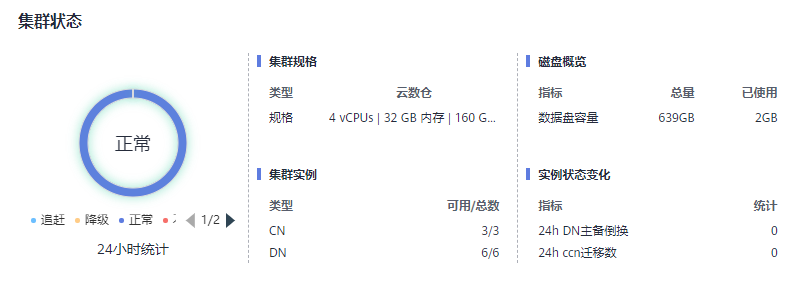
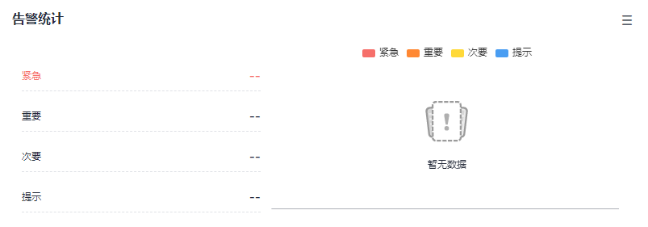
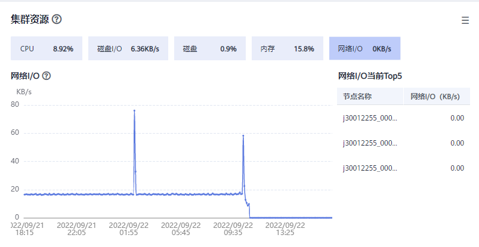
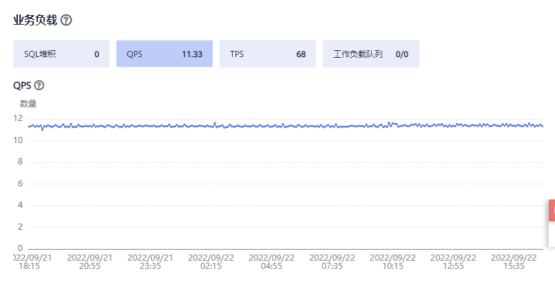
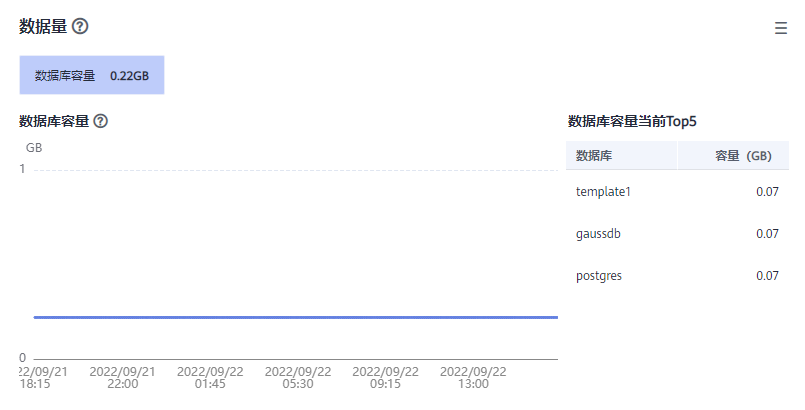
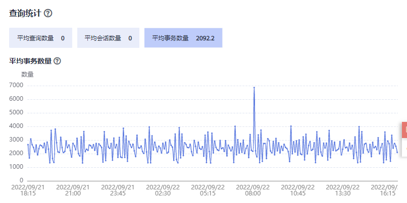

# 集群概览

## 进入集群概览页面

1.  登录GaussDB\(DWS\) 管理控制台。
2.  在“集群管理”页面，找到需要查看监控的集群。
3.  在指定集群所在行的“操作”列，单击“监控面板”。系统将显示数据库监控页面。
4.  在左侧导航栏单击“集群概览”，进入集群概览页面。

    在集群概览页面为客户展示了集群的状态，实时资源消耗，TOP SQL，集群资源消耗，数据库主要指标等信息。

> **说明：** 
>集群概览中显示的所有概览指标，都需要打开对应的采集项，如果某项指标关闭，则页面不会显示该指标相关项，并会弹出提示信息。对于该类情况，建议打开提示指标项即可。

## 集群状态

在“集群状态”一栏，您可以浏览当前集群状态和实例状态变化的统计信息，其中包括“24小时集群状态统计”、“集群规格”、“CN/DN可用数和总数”、“数据盘已使用量和总量”、“24小时CCN发生迁移数”、“24小时DN发生主备倒换次数”。

## 告警统计

在“告警统计”一栏，您可以查看当前集群未消除的所有告警，以及过去7天集群产生的所有告警信息，单击模块右上角“更多”按钮跳转至当前集群告警的详细信息，详情请参见[告警管理](告警管理.md)。

## 集群资源

在“集群资源”一栏，您可以查看当前集群资源使用情况，包括“CPU使用率”，“磁盘I/O”，“磁盘使用率”，“内存使用率”，“网络I/O值”。单击对应资源指标可显示过去24小时该指标的变化趋势，以及该资源当前时刻的Top5主机使用情况，单击模块右上角“更多”按钮可跳转至“节点监控”页面，节点按该指标值排序，详情请参见[节点监控](节点监控.md)。

## 业务负载

在“业务负载”一栏，您可以查看当前数据库业务负载指标，包括“TPS”、“QPS”、“SQL堆积”、“资源池中的运行任务/排队任务”，同时单击对应负载指标可显示过去24小时该指标的变化趋势。其中，”SQL堆积”指标依赖于实时查询监控，如果实时查询监控关闭，则不做展示。

## 数据库

在“数据库”一栏，您可以查看当前数据库已使用容量和模式已使用容量，单击对应容量指标可显示过去24小时数据库容量或模式容量的变化趋势，以及当前集群中Top5占比的数据库或模式，单击模块右上角“更多”按钮可跳转至“数据库监控”页面，数据库按数据库使用容量排序，详情请参见[数据库监控](数据库监控-0.md)。

## 查询统计

在“查询统计”一栏，您可以查看和数据库查询相关的指标，包括”平均查询数量”，“平均会话数量”，“平均事务数量”，单击对应查询指标可显示过去24小时该指标的变化趋势。其中，”平均查询数量”和“平均会话数量”指标依赖于实时查询监控，如果实时查询监控关闭，则不做展示。

