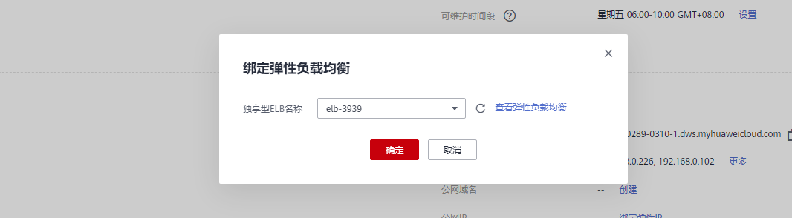
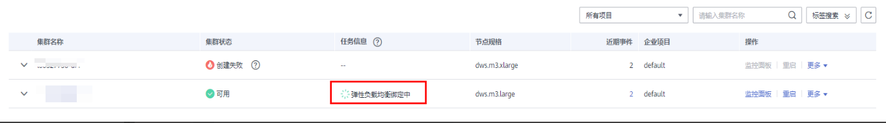
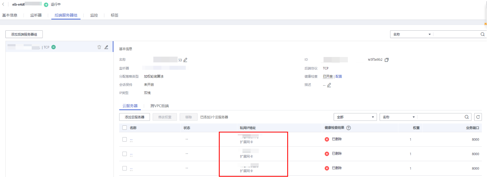
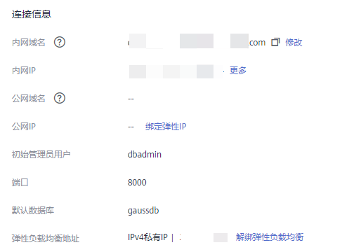
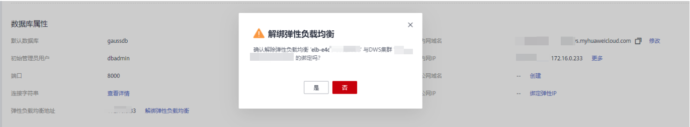
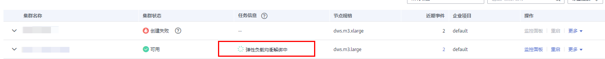
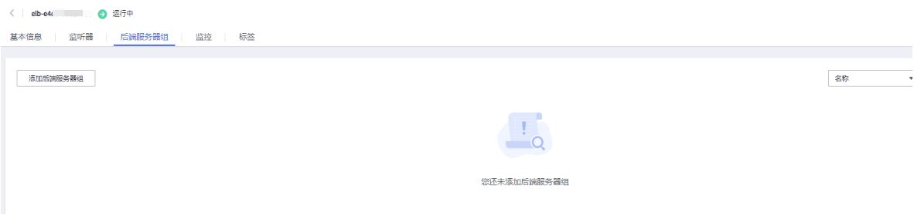

# 集群绑定和解绑ELB

## 概述

用户使用客户端连接DWS集群时，如果用户仅连接一个CN节点地址，通过该CN节点内网IP或弹性公网IP连接时，只能连接到固定的CN节点上，存在CN单点问题。如果通过内网域名连接时，利用域名解析的轮询特点，可以解决此问题。但内网域名仅限内网使用，使用公网域名访问时，还是存在CN单点问题，同时当前也不能在CN故障时进行请求转发，因此引入了弹性负载均衡服务（Elastic Load Balance，下称ELB），解决集群访问的单点问题。

弹性负载均衡（ELB）是将访问流量根据转发策略分发到后端多台弹性云服务器的流量分发控制服务，可以通过流量分发扩展应用系统对外的服务能力，提高应用程序的容错能力。了解更多，请参见[弹性负载均衡](https://support.huaweicloud.com/productdesc-elb/zh-cn_topic_0015479966.html)。

利用ELB健康检查机制可将集群的CN请求快速转发到正常工作的CN节点上，当有CN故障节点时，也能第一时间切换流量到健康节点上，最大化降低集群访问故障。

当前支持两种类型的ELB操作，如下：

-   [绑定ELB](#section14490205551611)
-   [解绑ELB](#section9928171214196)

> **说明：** 
>-   该特性仅8.1.1.200及以上集群版本支持。
>-   为保证集群负载均衡和高可用，避免CN单点故障问题，客户生产业务下，要求集群创建后进行ELB绑定。

## 约束与限制

-   绑定ELB时，需创建和GaussDB\(DWS\)集群相同的区域、VPC以及企业项目的ELB进行绑定。
-   GaussDB\(DWS\)的ELB功能仅支持独享型ELB规格，不支持共享型ELB绑定操作。

    > **须知：** 
    >部分Region因为独享型ELB规格没有上线，所以不支持负载均衡能力。

-   绑定ELB时，需创建TCP网络型且有内网IP的ELB进行绑定。
-   创建ELB时，ELB规格需要用户按本身业务访问流量评估，建议选取最大规格。GaussDB\(DWS\)侧仅是绑定关联ELB，并不改变ELB规格。
-   创建ELB时，仅需创建ELB，无需创建ELB服务的监听器与后端服务器组，GaussDB\(DWS\)会自动创建所需要的ELB监听器与后端服务器组。
-   创建ELB时，不能存在与数据库相同端口的监听器，否则会导致ELB绑定失败。
-   绑定ELB时，GaussDB\(DWS\)侧默认为ELB服务配置“ROUND\_ROBIN”转发策略，并设置10秒的健康检查间隔，50秒超时时间以及3次重试次数。用户如果需要修改此ELB默认参数时，请充分评估影响。
-   解绑ELB时，GaussDB\(DWS\)侧会清除ELB中集群相关信息，但并不会删除用户ELB，请注意ELB本身的计费影响，防止不必要的成本支出。
-   如需要公网IP或者域名访问ELB集群时，请通过ELB服务管理页面进行EIP绑定或者域名操作。

## 绑定ELB

1.  登录GaussDB\(DWS\) 管理控制台。
2.  单击“集群管理“。默认显示用户所有的集群列表。
3.  在集群列表中，单击指定集群名称进入“集群详情”页面。
4.  单击“绑定弹性负载均衡”，选择需要绑定到此集群的ELB，若不存在ELB，则可在ELB服务页面创建完成后，在DWS侧刷新进行重新绑定即可。

    

5.  绑定命令下发成功后，返回集群管理页面，集群列表将显示“弹性负载均衡绑定中”任务信息，绑定需要一定时间，请耐心等待。

    

6.  进入负载均衡服务控制台，单击绑定的ELB名称，切换到“后端服务器组”页签，检查集群CN节点是否被正确绑定到ELB中。

    

    > **说明：** 
    >ELB后端节点健康检查结果为已删除时可忽略，仅为ELB服务显示问题。

1.  绑定成功后，进入“集群详情”页面中的“连接信息”区域，可以查看ELB对外服务提供的IP地址，后续连接DWS集群使用此地址。

    

## 解绑ELB

1.  登录GaussDB\(DWS\) 管理控制台。
2.  单击“集群管理“。默认显示用户所有的集群列表。
3.  在集群列表中，单击指定集群名称进入“集群详情”页面。
4.  单击“解绑弹性负载均衡”，进行ELB解绑操作。

    

5.  解绑命令下发成功后，返回集群管理页面，集群列表显示“弹性负载均衡服务解绑中”任务信息，解绑需要一定时间，请耐心等待。

    

6.  进入负载均衡服务控制台，单击解绑的ELB名称，切换到“后端服务器”页签，检查集群CN节点是否已被删除。

    

