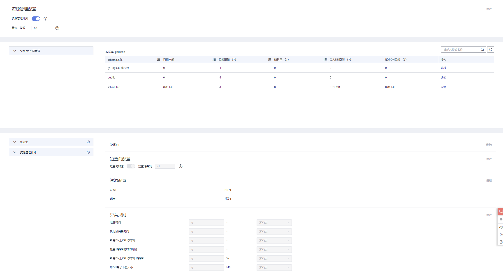
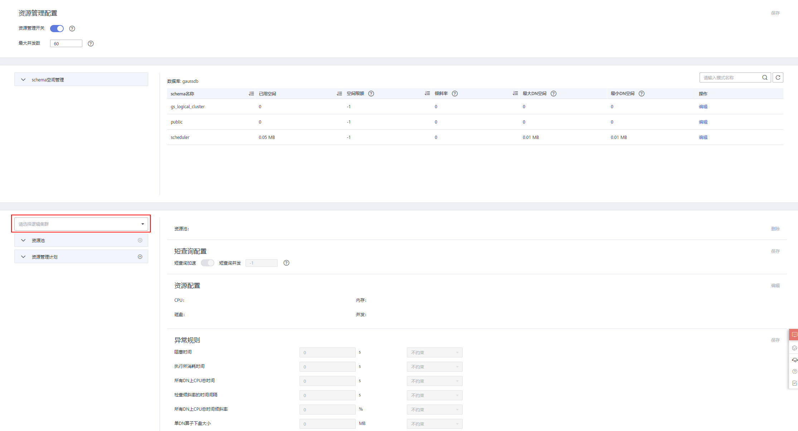
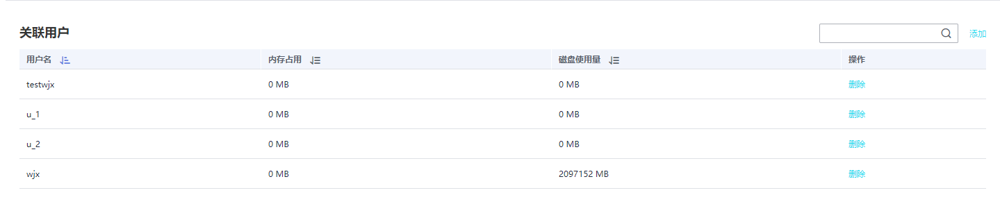

# 页面概览

## 页面概览

在资源管理页面，您可以修改资源管理的全局配置，可以在资源管理页面添加、创建、修改资源队列，添加数据库用户至资源池，也可以将资源池中的某个数据库用户从此资源池中移除。页面总共分为五个模块：

-   [打开或关闭资源管理功能](#section74345085)
-   [短查询配置](#zh-cn_topic_0000001076801475_s4a09406e8f3349b291f6db0d5a9af329)
-   [资源配置](#zh-cn_topic_0000001076801475_s5e5d6e352af34816a3d135a1b4e4d4ba)
-   [异常规则](#zh-cn_topic_0000001076801475_se98f1ed737af4df4adb73cd007b1b384)
-   [关联用户](#zh-cn_topic_0000001076801475_sa6c457572f8c403e9929518ebc352785)

当集群转换为逻辑集群后，可以选择指定的逻辑集群进行同样的资源池的创建、修改、删除。

## 打开或关闭资源管理功能

资源管理配置包括资源管理开关、全局最大并发数。这里的全局最大并发数指的是单个CN上的最大并发数，如果您通过资源管理开关关闭了资源管理功能，那么所有的资源管理功能将不可用。

## 短查询配置

在“短查询配置”一栏，您可以通过开关键决定是否开启短查询加速功能。如果需要对短查询并发数（默认为-1，0 或-1表示不控制）进行修改，可选择打开短查询加速。

## 资源配置

在“资源配置”一栏，您可以浏览当前资源池的资源配置情况。包括：

## 异常规则

在“异常规则”一栏，您可以浏览当前资源池中的异常规则设置情况，异常规则允许您对资源池中用户执行的作业做异常控制。目前支持的异常处理规则如[表1 异常规则参数](功能介绍.md#table595493692317)所示。

## 关联用户

在“关联用户”一栏，您可以浏览当前资源池中已关联的用户，且可以看到当前时间每个用户已使用的内存以及磁盘使用量，如下图所示。

